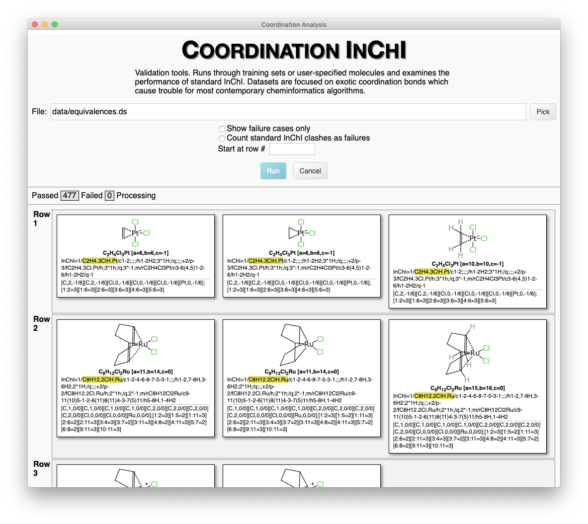
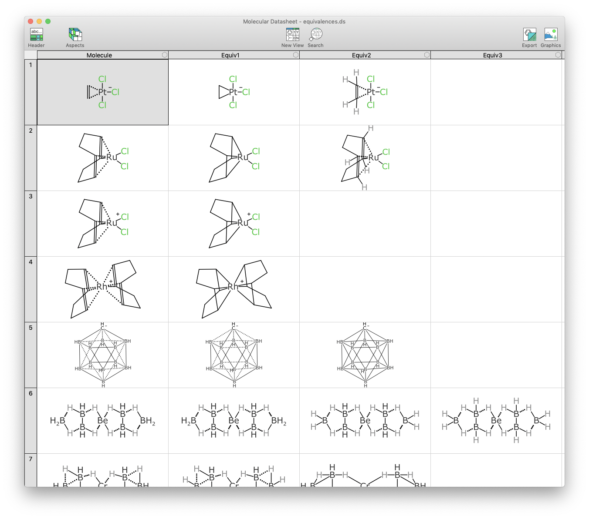
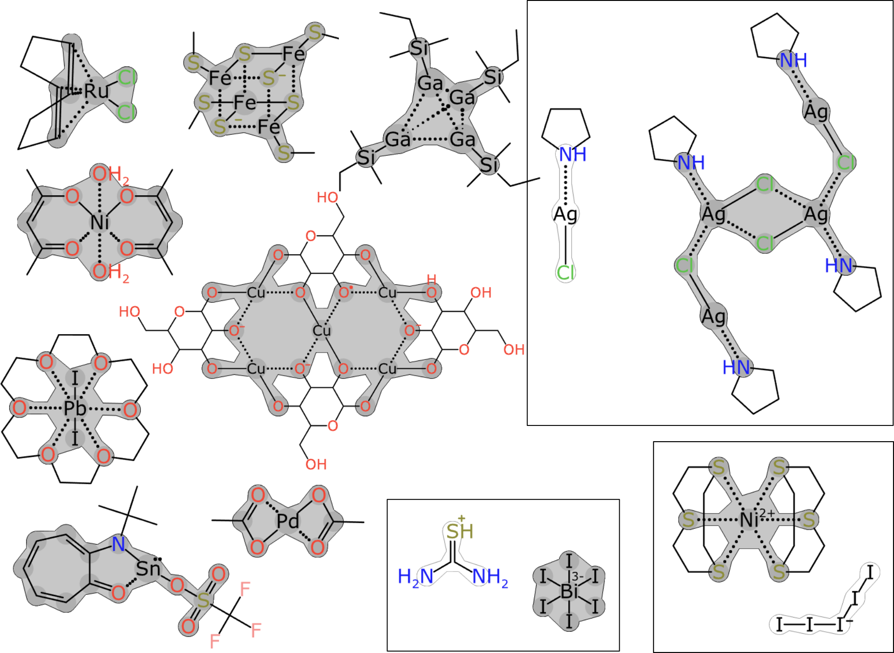
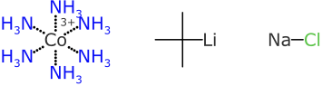
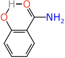
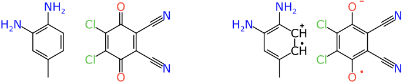

# Coordination Complexes for InChI: preliminary study

* Dr. Alex M. Clark
* September 2019

## Background

**Addendum**: This document describes Phase 1 of the project. Phase 2 [is described here](READMEph2.md).

The [InChI identifier](https://www.inchi-trust.org) is a canonical unique string that represents a chemical structure. The string is generated using an algorithm that _guarantees_ that multiple different ways of expressing the same chemical structure result in the _same_ InChI identifier. This guarantee has a number of caveats, but the general rule is that for organic compounds that are stable in aqueous solution and follow conventional variants of Lewis octet rule, the canonical properties of InChI are fit for purpose and have fewer edge cases than any widely adopted alternative technologies.

Unfortunately this does not hold when expanding out into the universe of chemistry beyond the organic subset. The biggest and most obvious problem with the InChI algorithm is that it treats metals by disconnecting them and converting into a salt form prior to generating the identifier. The loss of metal-ligand connectivity destroys essential information, and it means that two structures with the same mix of metals & ligands will imply the same unique identifier, even if their coordination mode is different.

While the information destruction definitely reduces the utility of InChI when applied to non-organic chemistry, it would not in itself completely eliminate it: inorganic compounds could use InChI as a _hash key_, if one were to assume that two different compounds occasionally gave rise to the same identifier, but that that two _same_ compounds would never give rise to a _different_ identifier. This is unfortunately not the case: due to the manner in which bonds to metals are disconnected, and the way in which standardisation rules are applied to the resulting components, there are many cases where the correspondence is violated (~20% of a representative inorganic training set). The reasons for this are buried deep inside the standardisation algorithms for the core InChI generator.

An additional problem (and possibly the main reason why this situation persists) is that the predominant way of sharing chemical structures is to use the MDL Molfile format, which has been quasi-documented since the 1980s, and is used by almost every cheminformatics package ever created, ranging from disposable scripts to monolithic commercial platforms. The original specification of the format was designed without any consideration for bond types other than those used for drug-like organic compounds. Although the specification has subsequently been augmented, the format is for all practical purposes defined to be the alphabet of properties that are compatible with _every_ software package within a given workflow, which means that it is risky to use bond types other than single/double/triple. There are some unfortunate workarounds for representing exotic bond types with just these 3 choices: the least incorrect method is to use charge separation to balance out the valences on main group atoms, in order to ensure that the implied hydrogen calculations work correctly (which, incidently, cannot be overridden without using recent additions to the format, which have serious compatibility issues).

The InChI algorithm was originally created within a milieu where non-organic compounds were considered outside of the domain of cheminformatics, and even if the algorithm set out to handle them well, there was neither a suitable input format nor any well thought out datasets to utilise it.

The goal of this project is to survey a representative range of non-organic compounds and examine how effective the current standard InChI identifier is, then find out what kinds of features cause it trouble. Having done this, a validation set will be created, such that attempts to improve or augment the InChI identifier can run through an answer key for pass/fail cases. An analysis of the success/failure modes will be included as part of the deliverable.

## Deliverables

Besides this summary document, there are two main deliverables for this project: (1) a validation set that can be used for a future implementation of coordination InChI, and (2) an interactive tool for applying and visualising this validation set.

This tool is shown below:



The analysis of inorganic functionality and its success/failure modes is provided by way of empirical example rather than static documentation. The interactive tool implements its own algorithm for creating a proof-of-concept identifier which can be used to resolve inorganic compounds with exotic bonding modes: structures that have been deemed to be equivalent (by the author, relying on prior experience in the domain of inorganic chemistry) are grouped together, and required to produce the same identifer. Structures that occur in different groups are required to produce a different identifier. The interactive tool checks these conditions, and compares the proof-of-concept method with standard InChI identifiers. Each of the equivalent structures is representative of a real world molecule, and is drawn using several different bonding patterns.

## Results

### Input Data

The first step was to gather inorganic chemical structure data, which is not a trivial process considering the absence of suitable file formats in common use. Four main sources were used:

* a small example set provided as part of the project (`data/iupaclist.ds`)
* curated molecules from a concatenation of private datasets (`data/curated-selection.ds`)
* a diverse selection of molecules from the [Cambridge Structural Database](https://www.ccdc.cam.ac.uk/solutions/csd-system/components/csd/) (`data/csd-diagrams.ds`)
* a diverse selection of molecules from [PubChem](https://pubchem.ncbi.nlm.nih.gov/)

The curated molecules were taken from a variety of files accumulated over a decade or so, including examples from a [2011 paper](https://pubs.acs.org/doi/abs/10.1021/ci200488k) extolling the virtues of zero-order bonds for inorganic compounds. The set has been augmented by a number of reagents that were sketched out for chemical reactions, many of which involve inorganic/organometallic catalysts. The noteworthy feature of this collection is that each and every compound has been carefully drawn and represented for a combination of aesthetic layout, ideal valence/oxidation state, and with particular care to guarantee that hydrogen counts are correct. A workflow script was used to stream a large number of files and extract just the unique molecules with at least one element marking it as being outside of the usual organic subset. A diverse sample of ~500 of these molecules has been included.

Molecules from the _Cambridge Structural Database_ were obtained by writing a Python script to crawl through the database of just over 1 million structures and snatch every case with an element from outside of the organic subset, excluding polymers. Undocumented features within the API were used to extract the curated 2D diagrams, which are also decorated with a curated hydrogen-count, as well as several exotic bond types (e.g. aromatic or coordination bonds). This subset included almost half a million structures, and so it was followed by workflow stream to sequentially emit diverse subsets. This technique involves proprietary technology that is not part of the deliverable, but it was used only to accelerate the cherry-picking process: about 400 structures were selected as being interesting for this purpose, and many of these were included in the final training set. It should be noted that the compounds obtained by this process are very well curated, and use a bonding scheme that attempts to describe the nature of the inorganic bonding realistically. Issues with valences and bond localisation are circumvented by ensuring that virtual hydrogen counts are explicit.

Molecules from _PubChem_ were obtained by downloading the entire collection from the [FTP site](ftp://ftp.ncbi.nlm.nih.gov/pubchem) and finding the subset of chemicals whose structures have at least one non-organic element qualifier, which makes for a little more than 500K structures. While the format used by the _PubChem_ database includes augmented bond types that make it possible to represent inorganic compounds effectively, these are almost never used by the depositors. Furthermore, a very large proportion of nontrivial structures have been seriously broken by passing them through a normalisation algorithm that is not fit for purpose. It is also quite likely that many cases are from dubious sources, such as text mining molecular formulae, or other incomplete descriptions. This collection of input options was selectively passed through a diverse subset filter, and ~200 structures were manually identified as something that could be manually fixed or redrawn, with the help of domain knowledge. These molecules are of some value as real world examples of compounds that have been prepared, represented and then submitted to a public database.

### Equivalences

The four data sources mentioned above were selectively combined into a single file (`data/equivalences.ds`) containing multiple molecule columns, as well as auxiliary data. Each row consists of at least two structures:



Within any given row, all of the structures are asserted to _refer to the same chemical entity_. Any two structures that are listed in a different row _refer to different chemical entities_. From a practical point of view, this means that all structures in a given row should generate the same InChI identifier, and for no two rows should this identifier be the same. The dataset can be used as a validation key when testing modifications or extensions to the InChI identifier.

There are ~500 rows at this time, about 75% of which originated from the _Cambridge Structural Database_. In these majority of cases, the original bond assignments and explicit hydrogen counts were preserved from the original database representation. Then alongside the original diagram is a manually adapted version which uses a smaller dialect of bond orders, consisting of 0, 1, 2 or 3, and constructed in a way that maximises idealised notions of valence and oxidation state, places formal charges on plausible atom centres, indicates pi-electron pathways, and infers the correct number of implicit hydrogens automatically whenever possible. In some cases higher order bond artifacts are added for aesthetic purposes, and inline abbreviations are used for clarity in the case of crowded molecules. For the ~25% or so that originated from sources other than CSD, care was taken to represent structures in multiple different ways, each of which is valid according to some rationale (e.g. taking a suboptimal representation from an external source and making the minimum number of corrections needed). In some cases molecules were drawn differently on purpose, and placed on different rows (e.g. drawing salt forms and connected forms, and noting that they are not expected to produce the same identifier).

### File formats

The validation materials are stored in files with the suffix `.ds` which is a DataSheet XML format for cheminformatics data which is roughly equivalent to the MDL SDfile, but without the very long list of inadequacies. The baseline format is straightforward, and is [described here](http://molmatinf.com/fmtdatasheet.html): it is a tabular format, in which columns are described in the header section, and each one is typed. One of the types is _Molecule_, for which the content adheres to the [SketchEl molecule format](http://molmatinf.com/fmtsketchel.html). Besides being straightforward and minimalistic, the _SketchEl_ molecule format is one of the very few cheminformatics datastructures that was designed with the intention of being inclusive of exotic nonorganic bonding arrangements, and so is a suitable container for the materials used in this project.

There are two main editors available for DataSheet XML (`.ds`) documents: if you have a Mac, the commercial [Molecular Notebook](https://apps.apple.com/app/molecular-notebook/id1006197668) app is an option. Otherwise, the open source [SketchEl](http://sketchel.sourceforge.net) tool can be used for datasheets and molecules. It's getting a bit long in the tooth, but it is coded with cross platform Java and still works on all the main desktop platforms. Furthermore the [WebMolKit](https://github.com/aclarkxyz/web_molkit) web runtime uses these formats natively, and is the major dependency of this project. There are several experimental tools based on this toolkit, but none of them are quite ready for editing datasheets.

### Validation

For the equivalence set described above, a little over 20% of the rows had problems whereby two equivalent molecules produced different InChI identifiers, or two different molecules produced the same InChI identifier. InChI identifiers were calculated using the `-FixedH` argument, after having added all hydrogens explicitly, which ensures that broken results are not caused by the implicit hydrogen calculation formula (without which the failure rate would be *much* higher).

Few of these clashes are solely because of the metal disconnection workaround, since it is relatively unusual to find two inorganic compounds with the same ligands connected in different ways (although like most edge cases, they tend to be densely clustered in certain workflows). The failure cases have not been studied extensively at the InChI composition level, but they appear to be largely due to the difficulty of finding a consistent way to disconnect the metals *and* normalise them afterward as if they were discrete species.

From the perspective of proposing a workable solution, the decision about which representations of real world molecules are considered to be the same and which are considered to be different is based on the following core requirements:

1. the heavy atom graph must be _complete_
2. hydrogen counts must be known unambiguously
3. bond orders must be descriptive enough to capture the electron delocalisation pathways
4. formal charges must be placed where they can be balanced

For **requirement #1**, the idea is that the input data must reflect a pre-existing decision about when two heavy (i.e. non-hydrogen) atoms are connected via something that deserves to be called a bond. The main point of contention is for salts, e.g. sodium chloride is often written as Na<sup>+</sup> Cl<sup>-</sup> rather than Na-Cl because the two ions dissociate complete in solution, and the solid state structure does not look like a distinct molecule. It is easy to make an argument for the former rather than the latter, but the important point is that for the purposes of the coordination InChI, the salt form and the bonded form are considered _different_ entities. 

A more nuanced example is butyl lithium, which can be represented as CH<sub>3</sub>CH<sub>2</sub>CH<sub>2</sub>CH<sub>2</sub><sup>-</sup> Li<sup>+</sup> or as CH<sub>3</sub>CH<sub>2</sub>CH<sub>2</sub>CH<sub>2</sub>Li. A case could be made for representing as either the ionic or covalent form, since the scientific reality is somewhere in the middle. The anionic terminal carbon and the cationic metal ion are strongly bound to each other, and they do have some of the characteristics of two atoms that are bonded together. It would be nice to be able to accept either form and be able to resolve both representations as referring to the same substance, but unfortunately this is not practical. The first issue is that because the InChI algorithm takes connection tables as input, there is no way to infer bonds that have not been indicated, because the information simply does not exist within the input content. Deletion of input bonds is possible (which the current standard InChI makes use of), meaning that it's a one way trip. Making a decision about whether to represent two atoms as being bonded to each other can usually be done easily by a scientist, and when it is not easy, the scientist can fall back on experimental evidence: hence it is necessary to insist that they do so before providing the input connection table.

There are plenty of other considerations to take into account when deciding whether to represent two heavy atoms as being bonded or not. Generally interactions like hydrogen bonds should not be listed as explicit bonds, because in spite of being often quite strong, they are not necessary to capture the core connection table/valence description of the molecule. It is better to leave these out of the core representation, and capture the information in some other higher order metadata (e.g. accompanying 3D structure). Structures are often derived form solid state structures in which crystal packing (or disorder/other artifacts) make two atoms appear to be close enough to have a bond, even though an unusual valence state is implied. These issues need to be resolved by the scientist who is making the claim, not by an algorithm within the InChI codebase. The use case for any current or future kind of InChI identifier is to ask the question "are these two structures the same thing?". The universe of inorganic chemistry is just too diverse to allow the creation of hard rules to resolve many of these issues, and so the responsibility of formulating the scientific claim has to be taken seriously by the scientist.

**Requirement #2** is that each heavy atom must have its number of attached hydrogen atoms known, even if they are not drawn explicitly. If the computed/recorded number differs from what was actually intended, then the corresponding InChI will be _wrong_, and it will not match that of a structure for which this was provided correctly. This is a major headache for most commonly used structure drawing tools, and is a problem for the MDL Molfile format that is used for most data storage. The problem is caused by the fact that for most druglike organic molecules, the number of hydrogen atoms attached to any given heavy atom can be easily calculated using a simple formula and a short lookup table, which saves the chemist much time and effort. The actual number of hydrogen atoms frequently does not match the formula when nonorganic molecules appear in the system, and one of the chronic limitations of the common subset of the Molfile format is that there is no way to disable automatic hydrogen addition. When the calculated number of hydrogens is two few they can be added as explicit atoms, but when it is too many, there are major compatibility problems between various different implementations. This is an ongoing problem that is being resolved at a glacial pace. The best advice is to assume the worst for any incoming dataset: trust only after verifying that the originating software supported the necessary features, and that it was operated correctly by the curators. For almost all datasets, this is not the case.

**Requirement #3** is predicated on the idea that even though there are often many ways to draw a bonding pattern using bonds of order 0 through 4, special notations for aromatic bonds, and assignment of charges and radical counts to atoms, the chemical reality is that certain blocks of connected atoms, these are all just difference resonance forms of the same thing. Or put another way, if a charge or higher order bond was placed in the "wrong" place, the mobile electrons would immediately relaxed back into the "right" place. The practical impact is that it is actually quite difficult to draw an incorrect resonance structure, and in fact making good choices for where to put the charges/bond orders is mainly for aesthetics and improving the hit rate for automatic hydrogen calculation (which saves a lot of time and reduces a lot of mistakes when drawing out structures).

The concept of an _electron delocalisation island_ is that each of these marks a subgraph whereby electrons can freely equilibrate. Making use of this idea is best done by enumerating the exceptions: for simple cheminformatics purposes, it is a reasonable working rule that electrons do not jump between connected components; and, heavily saturated main group atoms with no pi-bonds, or charges, or Lewis acid/base characteristics, generally do not allow electrons to pass. The most common example is sp<sup>3</sup> carbon, but there are other judgment calls that can also be made about when an atom is considered "blocking".

Once a set of [preferably very simple] rules have been applied to decide which-if-any atoms are blocking, all distinct components of 2-or-more non-blocking atoms can be enumerated. For inorganics, it is often the case that each moiety has one central core of atoms with free-moving electrons, e.g.:



**Requirement #4** is that formal charges be placed on the correct delocalisation island. If two structures are the same but for the fact that disconnected islands have different net charges, then they will be resolved as different compounds, due to charge separation. Obviously at this resolution we do not have the option of making a judgment call about whether electrons are capable of tunnelling through space or across normally inert sp<sup>3</sup>-like blocking atoms, but with a reasonable amount of common sense, the rules work quite well.

With each of these rules being taken into consideration, a relatively straightforward proof-of-concept graph resolution has been prototyped. The molecular graph is first stripped of all "boring" hydrogens (i.e. neutral, monovalent, etc.), leaving a graph of just heavy atoms (and in some cases, bridging hydrogens). Nodes are labelled based on:

* element atomic number
* attached hydrogen count
* average net charge (island total charge / island size)

Edges are labelled based on their average bond order, which is determined by the total number of bonding electrons for atoms within the island divided by 2 x number of bonds.

Once the nodes and edges are labelled, determining a walk class order is a matter of conventional computer science. The nodes can be resolved to an initial priority by sorting & ranking their initial label properties. Nodes are iteratively re-classified by enumerating their neighbouring priorities, modified by the bond properties, and re-ranking. Once the priorities cease to change, if the list contains any degenerate values, then the lowest value is _bumped_, and the iteration continues. At the end of the process, each node has a unique priority value. If the atoms are re-ordered according to the computed priority, then it becomes possible to do a direct comparison between any two structures: they will present the same graph if and only if they are the same structure, as defined by the requirements above.

With the labelling and walk class information determined, it is straightforward to propose any number of ways to assemble a string hash, which can be compared directly, in the same way as is the InChI identifier. At this point the proof-of-concept hash code achieves 100% resolution of same/different structures in the training set. Exceptions and issues are described below.

The main point of failure with this approach is the ability to perceive the _electron delocalisation islands_, which has to be done using a set of rules that is simple and generic. These rules have been tuned so that they work with a large and diverse set of real world inorganic compounds, which were selected without any kind of bias toward the algorithm. The approach has a key advantage in that it is highly agnostic to the input drawing style, which means that extensive retaining of users will not necessarily be required in order to make coordination InChI identifiers useful - with the exception of being careful with hydrogen counts, and using tools that allow them to be captured correctly.

## Issues

The following situations require some awareness with regard to the current proof-of-concept method for disambiguating inorganic compounds. The list should be updated as new edge cases are found (or resolved).

### Anti-aromaticity

Almost all cases of alternating single-double bonds can be thought of as being free pathways for electrons to arrange themselves wherever they please. This is often described as *aromatic*, though to do so is often misleading, because aromaticity is a continuum. The decision about whether or not two alternate resonance forms should be considered as distinct compounds for purposes of generating a canonical identifer is a binary one, and so making a cutoff rule based on limited information is inviting trouble.

The quintessential counter example is an asymmetrically substituted cyclooctatetradiene, which has two resonance isomers:


While it is unlikely that anybody will try to sell you a bottle of one rather than the other, the two isomers are distinctly different compounds because the bond count violates the Hückel rule (4N+2). This can be experimentally verified. The current proof-of-concept method for perceiving *electron delocalisation islands* considers any sequence of alternating single/double bonds to be valid resonance paths, because the Hückel rule is actually a lot harder to apply than the simple formula would suggest. Because there are so few useful real world exceptions, it is much preferable to keep a minimalistic rule that is simple to apply and has a tiny handful of known exceptions than to propose a complex rule system that has a large number of yet-to-be-determined exceptions.

Anti-aromatic compounds are presently a casualty of the preference for simple resonance detection rules. There are two possible ways to fix this: one is to apply the 4N+2 rule in a way that solves more problems than it creates (which is difficult). The other is to implement an additional input flag for bonds, which allows the operator to indicate that π-electrons *cannot* pass through it. So for the two isomers of substituted cyclooctatetraene, the four single bonds could each be marked as impassable. This would cause the perception of 4 electron delocalisation islands rather than just 1, making it possible to distinguish between them.

### Ionic vs. covalent

As mentioned earlier, the distinction between ionic and covalent bonds is often simple but frequently not, and the judgment call has strong implications. It is proposed (and implemented in the proof-of-concept) that the coordination InChI algorithm will not add or remove bonds: the existence of absence of a bond is the decision of the operator (or in some cases an import filter).

Consider the following 3 structure representations:



On the left is cobalt with 6 ammonia ligands. Each of the ligands is definitely attached to the cobalt metal, whereas whatever counterions are present to balance the charge are not. This is true in both solution and in the solid state, and so the presence of these metal-ligand bonds are not only real, but also essential to the identity of the molecule.

On the right is sodium chloride, for which the two constituent atoms are generally considered to *not* have a covalent bond. In solution the atoms are ionic and completely dissociated, whereas in the solid state they exist in a uniform lattice. In this case, the bonded form is discouraged: the ionic version should be encoded explicitly in the input.

In the middle is t-butyl lithium, which is drawn with a bond between carbon and lithium. It could just as easily be drawn as a carbanion and a lithium cation, but the bonded form is encouraged in this case: there is a genuine connection between the two atoms, both in solid and solution state. The compound is often considered to be somewhere in the middle range between covalent and ionic, meaning that both forms are similarly valid. The tiebreaker is the fact that the atoms are strongly associated with each other, and for that reason it is better to feed the coordination InChI algorithm with an input structure that indicates this, i.e. by including the bond in the connection table. Note that it does not need to be a single bond (which implies covalence): a zero-order bond with charges on the atoms would also work, and capture the notion that they are somewhat ionic.

Note also for the alkyl lithium case, this does not capture the experimental likelihood that what is contained in a bottle is probably an adduct of THF or some other ether, and it may also aggregate. These are experimental observations that are at the discretion of the creator of the input content, since no variant of InChI tries to do anything more than interpret the incoming connection table.

### H-bonds

Given the availability of a 0-order bond that can be used to indicate a bonding interaction without altering the valence of either atom, it might be tempting to use these to describe hydrogen bonding interactions, e.g.



It is hard to argue that this is wrong from a scientific point of view, but for purposes of creating an InChI identifier, it is unhelpful. While there are a variety of odd bonding arrangements between hydrogen and metals (including 3 centre/2 electron bonds that are most easily drawn using one zero order bond, and look analogous to the diagram above), in the metal case, these are necessary to capture the constitutional makeup of the molecular structure. For the most part, this is not true for hydrogen bonding in organic compounds: it should be thought of as an experimental characteristic that occurs under some conditions and not others.

The hydrogen bond should *not* be included in the input for the above compound, if for no other reason than the fact that many chemists will not see the need to indicate that the H-bonding interaction is a characteristic of the model. It makes more sense to include this in higher order metadata, which something as low level as an InChI identifier can ignore. If this subtlety turns out to be a significant problem in practice, it may be necessary to consider a pre-filter that can detach certain types of bonds. While a core principle of this proposal is that bonds should be believed, it is only the addition of bonds that is completely off the table. Deleting them is a possibility, although preferably a last resort.

### Charge transfer

Any case where two otherwise identical input structures have differing net charges on any particular delocalisation island will cause different results. This can be caused by errors (e.g. two components of a salt where the charges were mistakenly omitted), or they can be caused by two entities that are arguably distinct, depending on the circumstances. One example is charge-transfer complexes:



The entity shown on the left shows the neutral forms of the two components. The entity on the right is one valid resonance form for when an electron has been knocked out of the donor component and onto the acceptor component (e.g. after being hit by a photon with just the right energy level). The whole point of making such materials is that the relaxation from the higher energy form to the lower energy form does not happen instantly, and so the two descriptions refer to distinctly different chemical entities. However, sometimes the decay process is effectively instant. There is no reasonable way for a low level algorithm such as an InChI variant to make a ruling on how the physics works, especially since it is also dependent on missing context (e.g. solution vs. several different crystal packing orientations).

The current proof-of-concept algorithm classifies these structural entities as being different, because each of them has two delocalisation islands, and the charges differ.

## Installation

This **Coordination InChI** proof of concept runs under the [Electron](https://electronjs.org) framework, which is a stripped-down version of Google Chrome combined with [NodeJS](https://nodejs.org/en) which together provide a framework for creating desktop applications using JavaScript/HTML. Using this combination of technologies is not without its drawbacks and complexities, but it is the closest thing to a truly cross platform environment: the deliverable runs equally well on Windows/Linux/Mac with negligible customisation. With a little foresight, only a small portion of the codebase has to be tied to desktop environments (e.g. command line arguments, handling menus, clipboard, direct file access), which means that adaptation to running on a web browser or other encapsulated environment (e.g. mobile) can be done by only swapping out a few modules.

The down side is that deploying to the _Electron_ platform requires a bit more effort. The codebase is also written in [TypeScript](https://www.typescriptlang.org) which is a superset of _JavaScript_ that provides compile-time typing and proper datastructures, which makes maintaining a non-trivial codebase much more practical.

The following steps are necessary to compile & run the **Coordination InChI** project on a desktop computer. The instructions assume some familiarity with the command line prompt, which will be `bash`/`tcsh` for Linux/Mac, and the archaic `cmd.exe` for Windows.

### 1. NodeJS

`NodeJS` is a command line execution tool for running JavaScript without a graphical user interface, and `npm` is its corresponding package manager which makes it straightforward to install numerous open source utilities. These must be installed first.

Installing `NodeJS` and `npm` on Windows is typically [done graphically](https://treehouse.github.io/installation-guides/windows/node-windows.html) in one step.

Installation on Linux is usually best done through the distribution's package manager system, and can be accomplished with a [single command](https://nodejs.org/en/download/package-manager).

Installation on macOS is a bit more fun: there are several options, but the preferred one is to do it via the _homebrew_ framework. [This article](https://treehouse.github.io/installation-guides/mac/node-mac.html) describes the process of installing homebrew then using it to setup `NodesJS` and `npm`. Get settled in for some downloading, because it is in turn predicated on having the _Xcode_ command line tools, which are free-but-large.

Before proceeding, fire up the command line and enter:

```
$ npm
```

The result should be help text describing how to use the package manager, which means that the installation is successful. If you have an pre-existing version of npm, it might be a good idea to ensure that the latest version is installed:

```
$ sudo npm -g i npm
```

### 2. Electron

Once `npm` is running properly, installed `Electron` is simple. On Linux/Mac command line, install it globally using `sudo`:

```
$ sudo npm -g i electron
```

or on Windows:

```
$ npm -g i electron
```

The `npm` package manager generally does a good job of ensuring that the path matching works for subsequent command line use, although you may need to issue a `rehash` command on some Unix shells. To make sure it has been installed:

```
$ electron --version
```

### 3. TypeScript

The `TypeScript` compiler is also deployed as an `npm` package and can be installed with:

```
$ sudo npm -g i typescript
```

where the `sudo` part can be omitted for Windows. To ensure success:

```
$ tsc --version
```

### 4. Git

Accessing content stored on GitHub can be done several different ways, the canonical method being to use the command line `git` tool. The installation method [varies per platform](https://git-scm.com/book/en/v2/Getting-Started-Installing-Git), and is typically done via a package manager (Linux) or as part of Xcode (Mac) or installed via a graphical installer (Windows). There are other options, such as [GitHub's client](https://desktop.github.com/), or alternatively going to the corresponding repository website and downloading the latest content as a packaged ZIP file.

### 5. CoordInChI

Once the `Electron` and `TypeScript` prerequisites are in place, clone or otherwise download two GitHub repositories: one is the [CoordInChI](https://github.com/aclarkxyz/data_coordinchi) project, and the other is its dependency [WebMolKit](https://github.com/aclarkxyz/web_molkit). These should be installed in parallel at the same directory level, due to the fact that the former includes relative path links to the latter. So for example:

```
~/work/inchi
    --> CoordInChI
	--> WebMolKit
```

The packages can either be initialised using the git connections, or by unpacking the site's zip file. The command line invocations for Linux/Mac would be:

```
$ cd CoordInChI
$ git init
$ git remote add origin git@github.com:aclarkxyz/data_coordinchi.git
$ git pull origin master
$ cd ../WebMolKit
$ git init
$ git remote add origin git@github.com:aclarkxyz/web_molkit.git
$ git pull origin master
```

Verify that both of the directories (`CoordInChI` and `WebMolKit`) are populated with relevant content before proceeding.

Note that the names of the directories are important, especially the latter: the `CoordInChI` project explicitly refers to files in `../WebMolKit`, so if the client software picks a different directory name, it needs to be changed prior to compiling.

### 6. Compile and Run

The next step is to compile the _TypeScript_ inputs into a composite _JavaScript_ file. If everything is setup, this is straightforward:

```
$ cd CoordInChI
$ tsc
```

As long as the `CoordInChI` directory is current, and `tsc` (_TypeScript_) is installed, the compilation will proceed to create the file `app/coordinchi.js`.

Launching the compiled endpoint involves invoking the `electron` command. The minimal launch state can be achieved with:

```
$ electron app
```

The usual subject of the project is the validation file `data/equivalences.ds`, which can be indicated as the starting point with:

```
$ electron app data/equivalences.ds
```

For some of the functionality, it is useful to know the location of the command line InChI generator tool. This has been pre-run for the main validation file, so its availability is not necessarily essential. This can be specified with an additional command line argument, e.g.

```
$ electron app data/equivalences.ds --inchi ~/bin/inchi-1
```

### 7. Visual Studio Code

This last step is only important to anyone who wants to contribute to development of the project. The [Visual Studio Code](https://code.visualstudio.com/) IDE is free and lightweight (not to be confused with _Visual Studio_) and is the preferred method for editing code. It also allows the **Coordination InChI** tool to be launched with a couple of keystrokes.

### 8. Next Section

See [Phase 2](READMEph2.md) for continuation.