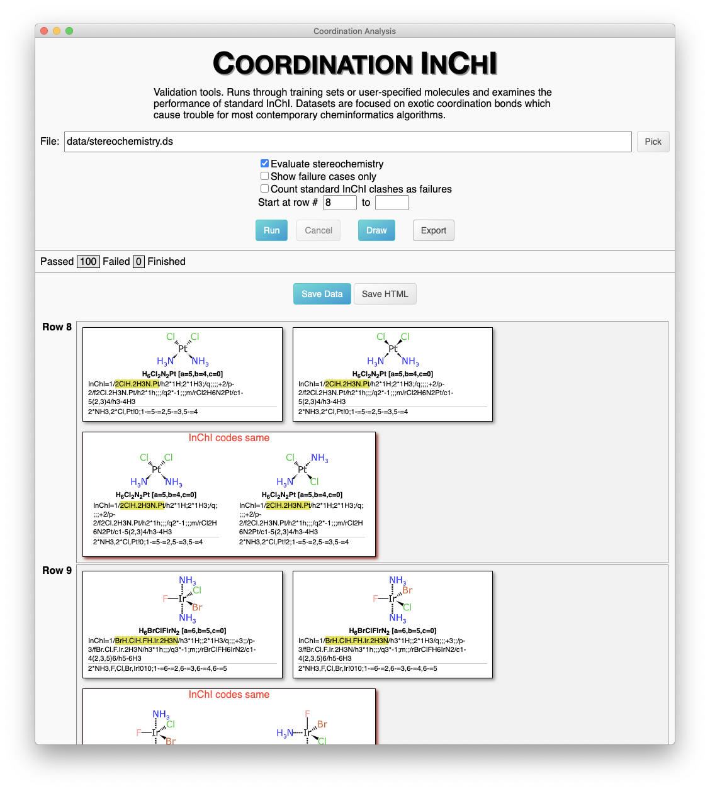

# Coordination Complexes for InChI: phase 2 study

* Dr. Alex M. Clark
* September 2020

## Summary

This document describes the second instalment. The documentation for [Phase 1](README.md) should be read first.

The initially-stated goals for this phase of the project:

1. respond to comments and address contributed edge cases
2. incorporate stereochemistry into the algorithm
3. formalise valid input formats (Molfile variants) 
4. finalise output layer for new InChI variant

Comments from the previous phase are addressed in a separate document (non-public). Additional edge cases have been added to the test set. The large majority of the work has gone into adding stereochemical centres to the method, so that R/S and E/Z can coeexist alongside square planar, trigonal bipyramidal and octahedral geometries. Standardisation of input formats has been achieved by careful adherence to the latest conventions from Biovia, rather than by using custom extensions. The proposed new output layer for addition to the InChI identifier satisfies the requirements for coordination complexes, as defined by a significant training set, and implemented by an openly available reference algorithm.

The deliverable for Phase 2 is a proposal for consideration to be incorporated into the official InChI technology suite. The recommendation is to implement the algorithm as part of the same platform as the standard InChI generator, and keep the coordination layer separate from the standard InChI molecular description. If anyone wishes to explore ways to enhance the core InChI generator to handle coordination complexes, then the training data is available to provide authoritative proof of the efficacy of any such attempt.

## Changes

Since [Phase 1](README.md), the following modifications have been made.

A second collection of validation structures has been added: `data/stereochemistry.ds`, which complements the original collection (`data/equivalences.ds`) from the first phase. The new collection contains more than a hundred cases where a structure containing at least one stereocentre is drawn as a 2D sketch, alongside two structures, both of which have the same molecular composition, but have the stereocentre(s) represented in a different way: one of them is equivalent, the other is non-equivalent.

The interactive tool has a clickable option to enable/disable stereocentre detection, so that the original dataset (sans-stereo) can be used. Running the tool from the command line can be invoked like so:

```
$ electron app data/stereochemistry.ds --stereo --inchi ~/bin/inchi-1
```



When stereochemistry is enabled, 5 types of stereochemistry are perceived: tetrahedral chirality (cf. R/S), fixed bond sides (cf. E/Z), square planar, trigonal bipyramidal and octahedral. The last three are not part of the original InChI capabilities, and are not found in conventional organic structures. The input of these stereocentres is based on perceiving coordinates and wedge bonds, and they follow the guidelines outlined in the _Biovia Chemical Representation Guide (2017)_. 

The interactive tool makes use of data that is stored using the [XML DataSheet format](https://github.com/aclarkxyz/mmi_formats/tree/master/datasheet). For use by other validation tools, the list of pairwise comparisons have been exported to standard SDfiles, which make use of functionality that is described in recent versions of the Biovia CTfile specification. These SDfiles have been validated for round-trip integrity to ensure that chemical meaning is preserved, and so they can be used as canonical inputs for a final InChI generator.

The _dot hash_ string that is generated by the algorithm differs from Phase 1, which had been a placeholder. The way the identifier is generated is more concise, makes it easy to derive the molecular formula, can be incorporated into a single layer, and is reminiscient of the style that InChI uses for its structure sections (although not identical, due to differences in the problem scope). A key distinction is that the presence of a resolved stereocentre can alter the atom priority order, which means that multiple stereo-states of a single composition can have a different bonding sequence, i.e. the stereochemistry is by necessity more deeply embedded into the coordination identifier, whereas for the standard identifier it is added in a subsequent layer as an afterthought. 

## Algorithm

The method of converting from an in-memory connection table graph to a string identifier is described below. The input assumes that all atoms and bonds are known, including hydrogen bond counts, charge localisation, and sufficient geometric information to infer the geometry of stereocentres. This baseline functionality has been provided for this reference implementation by the [WebMolKit](https://github.com/aclarkxyz/web_molkit) which is written in _TypeScript_ and is open source. The publicly available toolkit has a preexisting set of functions for perceiving metal-centric stereocentres, as well as a simple implementation of the "dots" method that is described below. Otherwise the toolkit itself can be considered largely interchangeable with some of the better open source toolkits that are available (e.g. _RDKit_, _CDK_) as well as the code used by the standard InChI algorithm to import Molfile structures.

There are three main modules that provide the functionality, and are mentioned below (``DotPath``, ``DotHash`` and ``DotCompose``). The total source code for these is less than 1500 lines, of which a substantial portion is source code comments. By software engineering standards, this is _short_. The following sections of this document are intended to prepare an expert software engineer with significant cheminformatics knowledge to begin analysing and understanding the source code. Some of the nuances of creating a unique molecular identifier are necessarily obtuse, but it should be straightforward to work out which sections of code are responsible for which aspect of functionality.

### DotPath

TODO

### Stereochemistry

TODO

### Pathfinding

TODO

### Hash Composition

TODO

## Recommendations

There are two recommendation options, the first of which is much more straightforward and likely to be successful: (1) adding an optional extra layer to the InChI string to complement the standard layers, and (2) upgrading the core InChI algorithm so that it can correctly process metal complexes as well as simple organic structures. The first option could opt to make use of all of the deliverables of this project (algorithm and training materials) and proceed to porting the new functionality to the C/C++ codebase used by InChI. The second option would require a complex retrofit of the core algorithm, and it is this scientist's professional opinion that it will not be successful. Nonetheless, if anyone wishes to try, the validation data will be extremely informative, and the proof of concept algorithm should provide some useful tips.

### Extra Layer

Adding an extra layer to an InChI code could be done by specifying an additional parameter to the command line tool that converts Molfile to InChI. An InChI representation of [cis-PtCl2(NH3)2] (_cisplatin_) would come out as:

`InChI=1S/2ClH.2H2N.Pt/h2*1H;2*1H2;/q;;2*-1;+4/p-2`

With the coordination layer option enabled, the result would be something like:

`InChI=1S/2ClH.2H2N.Pt/h2*1H;2*1H2;/q;;2*-1;+4/p-2/co2*NH3,2*Cl,Pt!0;1-=5-=2,5-=3,5-=4`

There could also be an option to generate a coordination layer only if certain conditions occur, e.g. the presence of a metal that would be disconnected. The idea of this option would be to refrain from adding the coordination layer when a conventional standard InChI would be sufficient for all purposes. Note that this should be validated against the training set as a composite feature, because there are a number of problematic standardisation features besides bond disconnection.

With the optional presence of a coordination layer, an algorithm could check to see if an InChI algorithm definitely represents _cisplatin_ by checking to see if the string contains the fragment `/co2*NH3,2*Cl,Pt!0;1-=5-=2,5-=3,5-=4`. If the scientist was trying to find _transplatin_, the search fragment would be `/co2*NH3,2*Cl,Pt!2;1-=5-=2,5-=3,5-=4`.

If the search was being performed on a database that did not include the new coordination layer for some or all of the content, the remaining molecules could be checked to see if they match the core InChI molecule description (i.e. with the bond disconnected and various other surgery performed): a match could be treated as a partial success. In this case it would match both _cis_ and _trans_ forms of the complex, because stereochemistry is not encoded. There are many other caveats about use of outdated drawing conventions, but the fallback option may still impart some value.

It should be noted that besides handling metal complex bond types and higher valent stereochemistry, the coordination layer lacks two major features: proton standardisation and tautomers. While the algorithm used to create the coordination layer is extremely effective at disambiguating multiple resonance forms, it has a hard requirement that _all_ atom-to-atom bonds must be indicated, including hydrogens (implicit or otherwise). This is a consequence of the empirical reality that organic chemistry has a number of _reasonably_ well defined rules for how covalently bound molecules composed from a limited list of a dozen or so elements behave under ambient conditions. Once just a few more elements from the periodic table are invited to the party, these rules break down immediately and exceptions quickly become the norm. The _DotPath_ approach is tolerant of a wide variety of opinions about bond type, but it takes as literal truth whether an atom or bond is present or absent.

The coordination layer has a domain that is a superset of the organic chemistry realm at which the standard InChI excels, and so it can be used for the same purposes: with the caveat that proton and tautomer normalisation is not a part of the method. This can be an advantage for some use cases, where converting to some allegedly-equivalent form is not desirable. The coordination layer can also be used in lieu of creating non-standard InChIs which switch off these normalisation features. 

Implementing the final version of the coordination layer should be done using C/C++ and be a part of the InChI identifier generator program. The code that performs the work could sit alongside the bulk of the current code, rather than being deeply intertwined with it: the entry level logic could delegate the layer creation to a separate module, and append the string to the final output. It likely makes sense to reuse certain functionality, such as the datastructure used to import the Molfile input, but note that the existing InChI reader needs to be updated to be compatible with newer additions to the Molfile specification.

Porting the codebase that generates the coordination layer from TypeScript to C++ should not be difficult: the core library routines in the proof of concept implementation have analogs in the Standard Template Library that is part of all C++ compilers, so the code can be transliterated quite directly. The proof of concept runtime is available to iteratively debug, and the comprehensive training set covers enough examples such that generating the correct answers with zero failures is strong evidence of success.

Selecting C as the destination language is also possible, but it would take more effort and the results would be roughly equivalent. The codebase is designed so that it can be easily ported to any modern language, and so coding platforms like Java, C#, Python and numerous others could be added without undue difficulty.

### Deep Integration

Another option, albeit discouraged, is to adapt the current InChI algorithm so that it is possible to add a switch to make it follow the paradigms that are necessary to general canonical strings for bonded metals. This would involve first bypassing the normalisation steps, and then incorporating the _dot path_ style of atom/bond classification. The method for determining walk-order would have to incorporate 5 types of stereochemistry, in a way that is equivalent to the deliverable from this project.

The advantage of this approach would be a unified codebase. It would still lead to a non-standard InChI, however, because even the most backward-compatible implementation would invalidate millions of existing database records. It may be possible to create identical InChIs under certain circumstances (i.e. when the additional features are not needed), but any time standardisation/tautomerisation/metal disconnect exists, it could activate the additional functionality.

If anyone wishes to pursue this approach, they are welcome to do so. The validation datasets should be considered as hard truth, for which there can be zero failures. The proof of concept implementation demonstrates that success is possible. Incorporating these ideas will be a challenge, if anybody is willing to take it on.

### External Validation

TODO