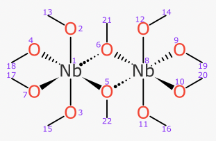

# Coordination Complexes for InChI: phase 2 study

* Dr. Alex M. Clark
* September 2020

## Summary

This document describes the second instalment. The documentation for [Phase 1](README.md) should be read first.

The initially-stated goals for this phase of the project:

1. respond to comments and address contributed edge cases
2. incorporate stereochemistry into the algorithm
3. formalise valid input formats (Molfile variants) 
4. finalise output layer for new InChI variant

Comments from the previous phase are addressed in a separate document (non-public). Additional edge cases have been added to the test set. The large majority of the work has gone into adding stereochemical centres to the method, so that R/S and E/Z can coeexist alongside square planar, trigonal bipyramidal and octahedral geometries. Standardisation of input formats has been achieved by careful adherence to the latest conventions from Biovia, rather than by using custom extensions. The proposed new output layer for addition to the InChI identifier satisfies the requirements for coordination complexes, as defined by a significant training set, and implemented by an openly available reference algorithm.

The deliverable for Phase 2 is a proposal for consideration to be incorporated into the official InChI technology suite. The recommendation is to implement the algorithm as part of the same platform as the standard InChI generator, and keep the coordination layer separate from the standard InChI molecular description. If anyone wishes to explore ways to enhance the core InChI generator to handle coordination complexes, then the training data is available to provide authoritative proof of the efficacy of any such attempt.

## Changes

Since [Phase 1](README.md), the following modifications have been made.

A second collection of validation structures has been added: `data/stereochemistry.ds`, which complements the original collection (`data/equivalences.ds`) from the first phase. The new collection contains more than a hundred cases where a structure containing at least one stereocentre is drawn as a 2D sketch, alongside two structures, both of which have the same molecular composition, but have the stereocentre(s) represented in a different way: one of them is equivalent, the other is non-equivalent.

The interactive tool has a clickable option to enable/disable stereocentre detection, so that the original dataset (sans-stereo) can be used. Running the tool from the command line can be invoked like so:

```
$ electron app data/stereochemistry.ds --stereo --inchi ~/bin/inchi-1
```


When stereochemistry is enabled, 5 types of stereochemistry are perceived: tetrahedral chirality (cf. R/S), fixed bond sides (cf. E/Z), square planar, trigonal bipyramidal and octahedral. The last three are not part of the original InChI capabilities, and are not found in conventional organic structures. The input of these stereocentres is based on perceiving coordinates and wedge bonds, and they follow the guidelines outlined in the _Biovia Chemical Representation Guide (2017)_. 

The interactive tool makes use of data that is stored using the [XML DataSheet format](https://github.com/aclarkxyz/mmi_formats/tree/master/datasheet). For use by other validation tools, the list of pairwise comparisons have been exported to standard SDfiles, which make use of functionality that is described in recent versions of the Biovia CTfile specification. These SDfiles have been validated for round-trip integrity to ensure that chemical meaning is preserved, and so they can be used as canonical inputs for a final InChI generator.

The _dot hash_ string that is generated by the algorithm differs from Phase 1, which had been a placeholder. The way the identifier is generated is more concise, makes it easy to derive the molecular formula, can be incorporated into a single layer, and is reminiscient of the style that InChI uses for its structure sections (although not identical, due to differences in the problem scope). A key distinction is that the presence of a resolved stereocentre can alter the atom priority order, which means that multiple stereo-states of a single composition can have a different bonding sequence, i.e. the stereochemistry is by necessity more deeply embedded into the coordination identifier, whereas for the standard identifier it is added in a subsequent layer as an afterthought. 

## Algorithm

The method of converting from an in-memory connection table graph to a string identifier is described below. The input assumes that all atoms and bonds are known, including hydrogen bond counts, charge localisation, and sufficient geometric information to infer the geometry of stereocentres. This baseline functionality has been provided for this reference implementation by the [WebMolKit](https://github.com/aclarkxyz/web_molkit) which is written in _TypeScript_ and is open source. The publicly available toolkit has a preexisting set of functions for perceiving metal-centric stereocentres, as well as a simple implementation of the "dots" method that is described below. Otherwise the toolkit itself can be considered largely interchangeable with some of the better open source toolkits that are available (e.g. _RDKit_, _CDK_) as well as the code used by the standard InChI algorithm to import Molfile structures.

There are three main modules that provide the functionality, and are mentioned below (``DotPath``, ``DotHash`` and ``DotCompose``). The total source code for these is less than 1500 lines, of which a substantial portion is source code comments. By software engineering standards, this is _short_. The following sections of this document are intended to prepare an expert software engineer with significant cheminformatics knowledge to begin analysing and understanding the source code. Some of the nuances of creating a unique molecular identifier are necessarily obtuse, but it should be straightforward to work out which sections of code are responsible for which aspect of functionality.

### DotPath

TODO

### Stereochemistry

TODO

### Pathfinding

TODO

### Hash Composition

TODO

## Edge Cases

The [Phase 1](README.md) algorithm describes several issues with the way this approach handles molecular composition, e.g. aromaticity vs. anti-aromaticity is not handled at all, ionic or H-bonds are treated as ground truth according to the input, and there is no tautomer equivalence functionality.

The 5 types of stereochemistry that are presently supported have a comprehensive list of test cases, and the algorithm achieves the correct result for all cases. There are however some nuances to be aware of.

There are other kinds of stereochemistry that are not captured. For example, the higher order axial stereochemistry of 1,1'-binapthyl derivatives is not handled at all, nor is the stereochemistry of allenes. Stereochemistry for three kinds of common metal geometries is handled: square planar, trigonal bipyramidal and octahedral, in addition to the tetrahedral option. Most transition metals adopt a geometry that fits into one of these, sometimes with empty position(s). Heavier elements, though, quite often have 7-or-more connection points with the metal. It is rare to encounter a situation where two stereoisomers not only exist but need to be distinguished, although doubtless this happens on occasion, and could happen more often in the future. These higher-valent stereocentres could be added without undue difficulty, using the same approach as the recently added types.

Certain kinds of ligands (e.g. arenes) adopt geometries that cannot be conveniently characterised as a Platonic solid, but they can in principle have more than one possible stereoisomeric geometry. The following compound is fictional yet plausible, and has two enantiomers:


The metal centre could be thought of as an octahedron whereby the cyclopentadienyl "cap" occupies 3 positions. This is a reasonable geometry classification, but the problem remains that the arene ligand has 5 points of attachment, so the graph contains 8 connection points (for a geometry that allows up to 6). Alternatively, it could be classified as disorted tetrahedral centre, if the arene ligand was classified as a single attachment point. Either way, the next problem is difficult: the arene ligand may have various kinds of rotational invariance. For this example the arene ligand is locked into place by a chelated phosphorus pendant, so the arene ligand itself has 3 carbon atom types based on graph composition, but these are caused to be inequivalent because they are held into place above the stereoactive metal centre. A similar compound with a fully symmetric cyclopentadiene (C5H5) ligand would be free to rotate, and thus all 5 carbon atoms would be equivalent. An intermediate form, with a single bulky attachment that is not chelated (e.g. t-butyl) would be formally free to rotate, but in practice it would likely not, and could give rise to even more stereoisomers than is suggested by the diagram (i.e. 3 distinct rotational energy wells x 2 different arrangements of other ligands = 6 total options). These are difficult issues to resolve scientifically, but also algorithmically, because adding additional constraints on the need for atoms to be equivalent-or-different based on higher order geometrical effects competes with the atom equivalence algorithm.

It is recommended that additional types of stereochemistry be ignored for the present time, and potentially addressed in a future release. These difficult scenarios exist somewhere in the long tail of edge cases. Their priorities can be ranked once the core functionality is in place.

A key feature of the way stereochemistry is processed in this algorithm is that it alters the walk-order of the graph. This is necessary but not particularly desirable: all other things being equal, it would be preferable to order the atoms according to their pure graph properties, and then decorate with stereochemistry labels after the fact. That way, molecules can be described as `{graph-part}:{stereo-part}`, and any two molecules with the same graph but different stereochemistry properties can be compared for compositional equivalence just by looking at the first part of each. This works for organic molecules that are limited to tetrahedral chirality and E/Z double bonds, due to the localised constraints: if the stereocentre has graph-equivalent neighbours, then there is no stereochemistry. This is _not_ the case for the additional stereochemistry types: square planar, trigonal bipyramidal and octahedral geometries can have graph-equivalent neighbours occupying ligand positions around an atom without invalidating the need to encode a stereochemistry state. For example, consider:



This metal complex has 2 octahedral stereocentres, which must be labelled, even though it has very high symmetry. Each of the niobium atoms has 3 different kinds of ligands: two _bridging_ ethoxides; two ethoxides that are _trans_ to the bridge (and _cis_ to each other); and two ethoxides that are _cis_ to the bridge (and _trans_ to each other). There are many ways to rearrange these ligands which all end up being the same, since they are essentially just 2 niobium atoms and 10 ethoxide ligands; however, if the bridging ethoxide ligands were somehow arranged on opposite sides of the metal, this would make for a different stereoisomer. And so the geometric labelling is required to disambiguate them.

If the atom ordering was done by graph composition, then each of the metal atoms would have 2 bridging ligands + 4 terminal ligands. Classifying the 4 terminal ligands as being equivalent is not correct, because the geometry partitions them into two different types (i.e. 2 bridging, 2 trans, 2 cis). If this further subclassification was not made, the atom walk algorithm could select either a _trans_ or _cis_ terminal ligand, and this would percolate through the algorithm, ultimately resulting in 2 (or more) possible canonical identifiers, any of which could be picked arbitrarily. This leads to failure of the algorithm.

For this reason, stereochemistry must be considered during the graph walk ordering, and it influences that order in which the graph is traversed. Two different stereoisomers of the same material often have coordination identifiers that have different atom sequences from each other, as well as a different parity index for the applicable atoms. This is also the case when comparing to molecules for which the stereocentre was not indicated.

An important consideration of the coordination stereochemistry types is that they do not correspond as neatly to ideas of entantiomers vs. diastereomers. The stereocentre constraint is added _if and only if it is necessary to disambiguate the geometry from other forms_. This introduces what might be considered a judgment call from one point of view, since metal-centred stereochemistry constraints can also be used to encode geometry. Consider [TiF4], the composition of which has very high symmetry. There are 4 possible geometries:


These are tetrahedral, square planar, truncated trigonal bipyramidal and di-truncated octahedral.

The algorithm disallows stereocentres for cases where symmetry is sufficiently high that there could not be more than one stereoisomer _given the indicated geometry_. This means that the current implementation chooses _not_ provide the ability to disambiguate between these 4 different geometry states for [TiF4]. The same is true for [TiF3Cl] drawn in the square planar form, because square planar complexes with 3 equivalent substituents do not have stereoisomers; but [TiF2Cl2] in square planar form _would_ be assigned a stereoisomer constraint, because there are both _cis_ and _trans_ form, and therefore this complex would be labelled according to its geometry, whereas its more symmetrical relatives would get no geometry information. If the diagram were drawn in truncated trigonal bipyramidal form, then [TiF3Cl] _would_ get a stereocentre label because there is a distinction between axial and equatorial ligands, whereas the square planar form itself has higher symmetry, and likewise for the doubly-truncated octahedral form.

The design and implementation of metal-centred constraints is intended only to solve the problem of disambiguation of stereocentres. The fact that geometry is also encoded in some cases is an incidental side effect. Other kinds of linear notations (e.g. SMILES) may find it useful to encode geometry regardless of whether it has stereo implications.

As for almost all cheminformatics algorithms, hydrogen atoms are an issue. The standard InChI identifier requires that it be possible to derive the molecular formula correctly, and for organic compounds, the default valence rules usually allow implicit hydrogen atoms to be computed correctly with a simple formula or, when it is not so obvious, the algorithm is able to guess correctly. The [phase 1](README.md) deliverable requires that the hydrogen situation be known with complete certainty, but that for "ordinary" hydrogen atoms, it does not matter whether it is _actual_ (has its own node in the graph) or _virtual_ (is a property of its adjacent heavy atom, either explicitly stated or implicitly calculated).

For phase 2, the tools for parsing incoming molfiles have been updated to use the formal valence model that is now available from Biovia, as well as additional bond type options that can serve as a placeholder for zero-order bonds. The atom valence property is an obtuse yet functional way to ensure that the virtual hydrogen count is correct. Ensuring that hydrogen counts are not miscalculated is still rather patchy with regard to its deployment within the wider community: it is not necessarily clear how many commonly used data-entry tools even allow these fields to be used correctly, and those which do may not make it intuitive. The vast majority of databases that take Molfile/SDfile content as input have not addressed this issue in any useful way, so this must be considered as a huge caveat when applying the coordination InChI layer to existing content: _if the virtual hydrogens cannot be calculated correctly, the output will be wrong_.

Prior to the addition of stereochemistry to the coordination layer, all _actual_ hydrogens were converted into _virtual_ (i.e. collapsed into a parent property and deleted from the graph) unless they had some unusual property, such as having more than one bond as is the case for bridging hydrides. With metal-centric stereocentres, however, this is slightly more interesting: when considering only tetrahedral and double bond stereochemistry, any atom centre with more than one hydrogen atom is not stereoactive. For this reason it is possible to standardise the output so that even stereoactive hydrogens are virtual, because the remaining heavy atoms are sufficient to define the geometry. For the metal-type geometries, however, it is possible to have two-or-more identical substituents and still need a stereochemistry label, i.e. having two hydrogen atoms does not invalidate the stereocentre. For stereocentres with two or more hydrogen atoms, they must be represented as _actual_ atoms, i.e. have their own node in the graph. Because this is necessary for some instances, it is therefore necessary for _all_ instances.

Therefore, when drawing a structure that has square planar, trigonal bipyramidal or octahedral geometry, all the hydrogens atoms must be represented as atoms, otherwise the stereocentre will not be considered. Tetrahedral centres and asymmetric double bonds are not subject to this rule. Any hydrogen atom that participates in a stereocentre is retained within the graph, for purposes of generating the identifier.

Consider the following two representations of the same molecular composition:


The diagram on the left will be interpreted as having an octahedral stereocentre at the tin atom, whereas that on the left will be considered as not having any stereocentres. Not only that, but the coordination layers will differ in terms of how the hydrido hydrogens are represented:

* `2*H,2*C,8*CH,2*N,2*O,Sn!320;1-17-=13-=3-=15-=17-=14-=4-=6-=8-=10-=12-=14,3-=5-=7-=9-=11-=13,4-=16-=17-2`
* `2*C,8*CH,2*N,2*O,SnH2;3-=1-=11-=15-=12-=2-=4-=6-=8-=10-=12,1-=13-=15-=14-=2,3-=5-=7-=9-=11`

In the first case, two of the hydrogens are represented as distinct entitites in the atomic composition part of the coordination layer (`2*H`), and referenced explicitly in the bonding patterns. In the second case, they are subsumed into their heavy atom neighbour (as `SnH2`), just like as is done for the other heavy atoms that have implicit hydrogens (in this case, `8*CH`).


## Deployment Recommendations

There are two recommendation options for deploying the coordination functionality as a formal part of the InChI suite. The first is much more straightforward and likely to proceed with fewest unexpected problems: (1) adding an optional extra layer to the InChI string to complement the standard layers, and (2) upgrading the core InChI algorithm so that it can correctly process metal complexes as well as simple organic structures. The first option could opt to make use of all of the deliverables of this project (algorithm and training materials) and proceed to porting the new functionality to the C/C++ codebase used by InChI. The second option would require a complex retrofit of the core algorithm, and it is this scientist's professional opinion that it will not be successful. Nonetheless, if anyone wishes to try, the validation data will be extremely informative, and the proof of concept algorithm should provide some useful tips.

### Extra Layer

Adding an extra layer to an InChI code could be done by specifying an additional parameter to the command line tool that converts Molfile to InChI. An InChI representation of [cis-PtCl2(NH3)2] (_cisplatin_) would come out as:

`InChI=1S/2ClH.2H2N.Pt/h2*1H;2*1H2;/q;;2*-1;+4/p-2`

With the coordination layer option enabled, the result would be something like:

`InChI=1S/2ClH.2H2N.Pt/h2*1H;2*1H2;/q;;2*-1;+4/p-2/co2*NH3,2*Cl,Pt!0;1-=5-=2,5-=3,5-=4`

There could also be an option to generate a coordination layer only if certain conditions occur, e.g. the presence of a metal that would be disconnected. The idea of this option would be to refrain from adding the coordination layer when a conventional standard InChI would be sufficient for all purposes. Note that this should be validated against the training set as a composite feature, because there are a number of problematic standardisation features besides bond disconnection.

With the optional presence of a coordination layer, an algorithm could check to see if an InChI algorithm definitely represents _cisplatin_ by checking to see if the string contains the fragment `/co2*NH3,2*Cl,Pt!0;1-=5-=2,5-=3,5-=4`. If the scientist was trying to find _transplatin_, the search fragment would be `/co2*NH3,2*Cl,Pt!2;1-=5-=2,5-=3,5-=4`.

If the search was being performed on a database that did not include the new coordination layer for some or all of the content, the remaining molecules could be checked to see if they match the core InChI molecule description (i.e. with the bond disconnected and various other surgery performed): a match could be treated as a partial success. In this case it would match both _cis_ and _trans_ forms of the complex, because stereochemistry is not encoded. There are many other caveats, but the important point is that it would be possible to implement a fallback that operates at the maximum capability of the current standard InChI.
 
It should be noted that besides handling metal complex bond types and higher valent stereochemistry, the coordination layer lacks two major features: proton standardisation and tautomers. While the algorithm used to create the coordination layer is extremely effective at disambiguating multiple resonance forms, it has a hard requirement that all atom-to-atom bonds must be indicated, including hydrogens (implicit or otherwise). This is a consequence of the empirical reality that organic chemistry has a number of reasonably well defined rules for how covalently bound molecules composed from a limited list of a dozen or so elements behave under ambient conditions. Once just a few more elements from the periodic table are invited to the party, these rules break down immediately and exceptions quickly become the norm. Attempting to derive a collection of tautomer rules that apply to compounds that involve a metal would be a fool's errand, and it would be equally futile to make any other kind of judgment call about how to standardise certain kinds of fragment patterns. The _DotPath_ approach is tolerant of a wide variety of opinions about bond type, but it takes as literal truth the atoms and their connectivity, as well as charge isolation within resonance islands.

The coordination layer has a domain that is a superset of the organic chemistry realm at which the standard InChI excels, and so it can be used for the same purposes: with the caveat that proton and tautomer normalisation is not a part of the method. This can be an advantage for some use cases, where converting to some allegedly-equivalent form is not desirable. The coordination layer can therefore be used in lieu of creating non-standard InChIs which switch off these normalisation features. 

Implementing the final deployment version of the coordination layer should be done using C/C++ and be a part of the InChI identifier generator program. The code that performs the work could sit alongside the bulk of the current code, rather than being deeply intertwined with it: the entry level logic could delegate the coordination layer creation to a separate module, and append the string to the final output. It likely makes sense to reuse certain functionality, such as the datastructure used to import the Molfile input, but note that the existing InChI reader needs to be updated to be compatible with newer additions to the Molfile specification.

Porting the codebase that generates the coordination layer from TypeScript to C++ should not be difficult: the core library routines in the proof of concept implementation have analogs in the Standard Template Library that is part of all C++ compilers, so the code can be transliterated quite directly. The proof of concept runtime is available to iteratively debug, and the comprehensive training set covers enough examples such that generating the correct answers with zero failures is strong evidence of success.

Selecting C as the destination language is also possible, but it would take more effort and the results would be roughly equivalent. The codebase is designed so that it can be easily ported to any modern language, and so coding platforms like Java, C#, Python and numerous others could be added without undue difficulty.

### Deep Integration

Another option, albeit discouraged, is to adapt the current InChI algorithm so that it is possible to add a switch to make it follow the paradigms that are necessary to generate canonical strings for bonded metals. This would involve first bypassing the normalisation steps, and then incorporating the _dot path_ style of atom/bond classification. The method for determining walk-order would have to incorporate 5 types of stereochemistry, in a way that is equivalent to the deliverable from this project.

The advantage of this approach would be a unified codebase. It would still lead to a non-standard InChI, however, because even the most backward-compatible implementation would invalidate millions of existing database records. It may be possible to create identical InChIs under certain circumstances (i.e. when the additional features are not needed), but any time standardisation/tautomerisation/metal disconnect exists, it could activate the additional functionality.

If anyone wishes to pursue this approach, they are welcome to do so. The validation datasets should be considered as hard truth, for which there can be zero failures. The proof of concept implementation demonstrates that success is independently possible. Incorporating these ideas will be a challenge, if anybody is willing to take it on.

### External Validation

TODO