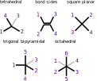

# Coordination Complexes for InChI: phase 2 study

* Dr. Alex M. Clark
* September 2020

## Summary

This document describes the second instalment. The documentation for [Phase 1](README.md) should be read first.

The initially-stated goals for this phase of the project:

1. respond to comments and address contributed edge cases
2. incorporate stereochemistry into the algorithm
3. formalise valid input formats (Molfile variants) 
4. make a formal proposal for the output layer for new InChI variant

Comments from the previous phase are addressed in a separate document (non-public). Additional edge cases have been added to the test set. The large majority of the work has gone into adding stereochemical centres to the method, so that R/S and E/Z can coeexist alongside square planar, trigonal bipyramidal and octahedral geometries. Standardisation of input formats has been achieved by careful adherence to the latest conventions from Biovia, rather than by using custom extensions. The proposed new output layer for addition to the InChI identifier satisfies the requirements for coordination complexes, as defined by a significant training set, and implemented by an openly available reference algorithm.

The deliverable for Phase 2 is a proposal for consideration to be incorporated into the official InChI technology suite. The recommendation is to implement the algorithm as part of the same platform as the standard InChI generator, and keep the coordination layer separate from the standard InChI molecular description. If anyone wishes to explore ways to enhance the core InChI generator to handle coordination complexes, then the training data is available to provide authoritative evidence of the efficacy of any such attempt.

Web-browsable versions of the results can be seen here:

* [equivalences](docs/output-equiv-20200902.html)
* [stereochemistry](docs/output-stereo-20200902.html)

## Changes

Since [Phase 1](README.md), the following modifications have been made.

A second collection of validation structures has been added: `data/stereochemistry.ds`, which complements the original collection (`data/equivalences.ds`) from the first phase. The new collection contains more than 150 cases where a structure containing at least one stereocentre is drawn as a 2D sketch, alongside two structures, both of which have the same molecular composition, but have the stereocentre(s) represented in a different way: one of them is equivalent, the other is non-equivalent.

The interactive tool has a clickable option to enable/disable stereocentre detection, so that the original dataset (sans-stereo) can be used. Running the tool from the command line can be invoked like so:

```
$ electron app data/stereochemistry.ds --stereo --inchi ~/bin/inchi-1
```


When stereochemistry is enabled, 5 types of stereochemistry are perceived: tetrahedral chirality (cf. R/S), fixed bond sides (cf. E/Z), square planar, trigonal bipyramidal and octahedral. The last three are not part of the original InChI capabilities, and are not found in conventional organic structures. The input of these stereocentres is based on perceiving coordinates and wedge bonds, and they follow the guidelines outlined in the _Biovia Chemical Representation Guide (2017)_. 

The interactive tool makes use of data that is stored using the [XML DataSheet format](https://github.com/aclarkxyz/mmi_formats/tree/master/datasheet). For use by other validation tools, the list of pairwise comparisons have been exported to standard SDfiles, which make use of functionality that is described in recent versions of the Biovia CTfile specification. These SDfiles have been validated for round-trip integrity to ensure that chemical meaning is preserved, and so they can be used as canonical inputs for a final InChI generator.

The _dot hash_ string that is generated by the algorithm differs from Phase 1, which had been a placeholder. The way the identifier is generated is more concise, makes it easy to derive the molecular formula, can be incorporated into a single layer, and is reminiscient of the style that InChI uses for its structure sections (although not identical, due to differences in the problem scope). A key distinction is that the presence of a resolved stereocentre can alter the atom priority order, which means that multiple stereo-states of a single composition can have a different bonding sequence, i.e. the stereochemistry is by necessity more deeply embedded into the coordination identifier, whereas for the standard identifier it is added in a subsequent layer as an afterthought. 

## Algorithm

The method of converting from an in-memory connection table graph to a string identifier is described below. The input assumes that all atoms and bonds are known, including hydrogen bond counts, charge localisation, and sufficient geometric information to infer the geometry of stereocentres. This baseline functionality has been provided for this reference implementation by the [WebMolKit](https://github.com/aclarkxyz/web_molkit) which is written in _TypeScript_ and is open source. The publicly available toolkit has a preexisting set of functions for perceiving metal-centric stereocentres, as well as a simple implementation of the "dots" method that is described below. Otherwise the toolkit itself can be considered largely interchangeable with some of the better open source toolkits that are available (e.g. _RDKit_, _CDK_) as well as the code used by the standard InChI algorithm to import Molfile structures.

There are three main modules that provide the functionality, and are mentioned below (``DotPath``, ``DotHash`` and ``DotCompose``). The total source code for these is less than 1500 lines, of which a substantial portion is source code comments. By software engineering standards, this is _short_. The following sections of this document are intended to prepare an expert software engineer with significant cheminformatics knowledge to begin analysing and understanding the source code. Some of the nuances of creating a unique molecular identifier are necessarily obtuse, but it should be straightforward to work out which sections of code are responsible for which aspect of functionality.

This documentation is current as of September 2020.

### DotPath

The first stage of creating the coordination layer involves processing the molecule by distilling the atom and bond properties into a limited form. When valence counting rules are applied to a hydrogen-suppressed organic structure, having bond orders, charges, radicals and hydrogen counts is an overspecification: one or two of these properties can be removed with most information still intact. The standard InChI algorihm emits a graph that lacks bond order and radical status, but includes charges and hydrogens. The "DotPath" algorithm takes a similar approach, except that it takes into account the fact that the realm of inorganic chemistry does not provide for any reasonable set of rules to localise charges on specific atoms. It is, however, possible to identify "islands of resonance" within graph components, sum up the formal charges within each of these islands, and treat the charge as being delocalised within that scope.

The [Phase 1](README.md) writeup contains an overview how this works, with visual examples.

The preprocessing algorithm is found in `DotPath.ts`, which can be found on [GitHub](https://github.com/aclarkxyz/web_molkit/blob/master/src/data/DotPath.ts).

The algorithm operates by going through a process of eliminating to discover _blocking atoms_. In this context, a _blocking atom_ is one that prevents resonance from passing through it. Most blocking atoms are sp<sup>3</sup> carbons. The large majority of other atom types are one of: terminal (i.e. doesn't matter as much), have a &pi;-bond, or have a valence shell (occupied or otherwise) that allows mobile electrons free passage.

This decision about whether an atom is blocking or not is one of the very few judgment calls that the coordination layer makes about chemical composition. As described below, the rules are simple and treat the idea of a special cases as an expensive liability. As composed, there are usually a great many ways to represent a structure that result in the same dot path classification, which is the goal. It is, however, the weakest link in the whole process: making a yes/no decision about the behaviour of an atom within any inorganic chemical graph is going to result in some decisions which are not optimal. The validation data provides strong proof that the results are excellent, but edge cases do exist. It is impossible to eliminate them all, but careful design can increase the extent to which they are rare and predictable.

The function `DotPath.calculate` runs through the whole calculation sequence:

* the bond graph is scanned to count up total bond order and mark atoms that participate in &pi;-bonds, or any other non-single bonds (including zero-order)
* any atom that has at least two neighbours, of which at least two have been marked as &pi; in the previous step, is marked as itself having &pi; character
* a constant whitelist of potentially blocking atoms is defined: the p-block
* a list of Lewis acids & bases is defined (a Lewis acid:base bond is always non-blocking)
* for each atom:
	* if it has only single bonds then it might be blocking; the following triage sequence is applied
	* if it has been designated a formal charge or unpaired electrons, skip
	* if it is not in the list of potential blocking atoms, skip
	* if any of its bonded atoms form a Lewis acid:base pair, skip
	* when the algorithm proceeds this far, mark the atom as being _maybe blocking_ (which is used later)
	* special deal for carbon: as long as all of the atoms to which it is bonded are in the p-block (or H), it is marked as _definitely blocking_
	* special deal for hydrogen: as above, without the neighbour requirement
* at this point, there may be some C or H atoms that have been marked as blocking, and some number of atoms marked as _maybe_ so
* for each atom:
	* if the atom is marked as _maybe_ blocking, and all of its neighbours are also marked as _maybe_ (or _actually_) blocking, then this atom is set to blocking
* now that a list of blocking atoms is known, the molecular graph is partitioned into components: the blocking atoms are isolated and all graph connected components with more than 1 node is ascertained; for each of these components:
	* a `DotPathBlock` data object is created
	* the atoms within the component, and all bonds between atoms in the component, are stored in the object
	* the algorithm then works out the number of valence electrons involved in the block as a ratio (expressed by the `numer` and `denom` properties)
	* there are two possible ways to add up the electrons: &Sigma;(V - C - O) or &Sigma;(S - V - O), where V is the number of electrons in the atom's valence shell, S is the size of the valence shell, and O is the number of adjacent atoms that are not part of the block (which includes implicit hydrogens); the total electron count (`numer`) is taken to be the minimum of these

The accumulation of these blocks is the analysis part of the algorithm. The properties that are used for the coordination layer are derived from the list of `DotPathBlock` objects:

* block charge: the net charge of all atoms within the block is added up, and for bookkeeping purposes, is assumed to be distributed equally across all atoms in the block
* bond order: the total number of electrons in the block is calculated as described above, and every 2 electrons is worth one bond; so if a block containing 4 bonds has 8 available valence electrons, all bond orders are set to 1; the carbon atoms of a benzene ring have 18 available valence electrons (4 per carbon atom, minus one because the implied hydrogen is not part of the block) spread over 6 atoms, giving a bond order of 1.5; the bonds within the block are assumed to be the same, because a simple valence counting algorithm cannot presume further knowledge about localisation

When building the coordination layer, net charges are averaged across the atoms, e.g. for a block of 7 atoms with a net charge of +1, each atom will be labelled as having a charge of +(1/7).

For bond orders the categories are divided into bins: [0, 0..1, 1, 1..2, 2, 2..3, >3]. This is actually not strictly necessary for disambiguation, but all other things being equal, retaining and using this information has two benefits: (1) it can speed up the algorithm because graph walk classes can be resolved with fewer steps, and (2) including the bond order category in the resulting identifier can be aesthetically desirable.

### Stereochemistry

Stereochemical constraints are enumerated as a preprocessing step, which is implemented in `Stereochemistry.ts`, available on [GitHub](https://github.com/aclarkxyz/web_molkit/blob/master/src/data/Stereochemistry.ts).

The first part involves studying the geometry and bond labels: for 2D structures, this involves {x, y} and wedge bonds; for 3D structures, this is done by examining the {x, y, z} coordinates, and wedges are ignored. The algorithms used to perceive the geometries can be considered routine, and are functionally equivalent to any number of cheminformatics toolkits. What is slightly less conventional is the way the geometry information is represented once the perception is complete: stereochemistry is encoded as a _rubric_, which is an array of atom indices for which the configuration is encoded in the order:



The returned _rubric_ is a list of atom indices, given in the order shown on the diagram above, the indicates just *one* of the possible orientations. Each of the stereocentre types has a number of permutations that equate to ways to rotate the geometry and still preserve the same stereochemistry. For example, a tetrahedron has 24 ways to attach 4 substituents onto the vertices. If all 4 substituents are different, then 12 of these permutations retain the same enantiomer, and there are 12 other permutations which do not (i.e. they turned it into the mirror image). Considering the chiral molecule CHFClBr: if the rubric for the chiral centre is perceived to be [H, F, Cl, Br] in one depiction, and [F, H, Br, Cl] in another, it can be ascertained that these are the same isomers, because the list of valid permutations includes [2, 1, 4, 3], which maps these to each other. If the alternate depiction gave rise to the rubric [H, F, Br, Cl], though, it can be seen to be the opposite enantiomer, because the necessary permutation is [1, 2, 4, 3], which is not in the approved list.

The class in `Stereochemistry.ts` defines valid permutations for each of the rubric types: tetrahedral has 12, bond sides has 4, square planar has 8, trigonal bipyramidal has 6 and octahedral has 24. However these permutations can get slightly more interesting when ordering graph walk order when one of the positions has been marked as incoming, which reduces the symmetry for current purposes. This is described in detail later.

The algorithm works with these rubric sequences because they are very convenient for the kinds of operations that are being performed on them: they have completely abstracted out the geometic representation of the input, and they have not yet been converted into an opaque parity identifier. The decision about whether there is actual stereochemistry is made _during_ the process of creating the coordination layer. For example, tetrahedral centres are discarded if any two attachments end up being equivalent, while double bonds stereocentres are discarded if any two attachments on the same side are the same. Note that the process of _same_ is not just about graph composition: the existence of multiple stereocentres within a component can force further disambiguation.

Each of these five types has its own quirks, which become important as the algorithm progresses. Where useful, the [right hand rule](https://en.wikipedia.org/wiki/Right-hand_rule) is used so as to make checking the order relatively straightforward.

* _tetrahedral_: the rubric order is encoded using the right hand rule, in which the first 3 atoms define the direction of rotation, and the 4th atom is in the axial _up_ direction using the right hand rule; tetrahedral chirality has the unique property of each atom being _cis_ to any other, which skips several extra kinds of nuance, and also means that this stereochemistry constraint only encodes for enantiomers, unless there is a second stereocentre

* _bond sides_: this is the odd one out, as the constraint occurs across a bond, but for algorithm purposes, it can be spread out across both atoms of the restricted-rotation bond; the numbering system can be used to determine whether two atoms are _cis_ or _trans_ to each other

* _square planar_: atoms are ordered consecutively around the centre; any given atom has two _cis_ partners and one _trans_ partner

* _trigonal bipyramidal_: atoms are ordered such that the 3 equatorial atoms define the direction of rotation and the two axial atoms (4 to 5) point in the axial _up_ direction using the right hand rule; this is the lowest symmetry type, and the 3 equatorial atoms and 2 axial atoms are not at all superimposable, even if their composition is identical

* _octahedral_: atoms are ordered such that any 4 atoms that are coplanar can be used to define the direction of rotation, and remaining two atoms point in the axial _up_ direction using the right hand rule; any given atom has four _cis_ partners and one _trans_ partner

For organic systems that provide resolution of tetrahedral and bond-side stereocentres, implicit hydrogen atoms fortuitously work out well: tetrahedral carbon atoms can have up to one hydrogen atom and still have a chiral centre, and the configuration only needs 3 neighbour atoms to define the geometry, so it works regardless of how the hydrogen atom is represented. Likewise for alkene stereochemistry: each side can have up to 1 hydrogen atom, and needs only one remaining position to define the geometry. This is also the case for C=N double bonds, some of which retain stereochemical configuration due to the lone pair on the nitrogen atom, which can be treated in the same way as an implicit hydrogen.

The other 3 stereocentres are largely the domain of metals and heavier p-block elements. The hydrogen presence rule is different for these: it _must_ be drawn explicitly, otherwise the stereochemistry will not be defined. This is because implicit hydrogens can be degenerate, i.e. two or more hydrogen atoms does not necessarily mean that the centre is stereoinactive. Implicit hydrogens can also compete with missing ligands, e.g. there would be one or more hydrogen atoms _and_ an absent position.

Permission for the 3 metal-domain stereocentres to have vacant positions is largely a constraint of the input perception routines. The main part of the algorithm is highly tolerant to vacant positions, but the algorithm used to match up the requisite number of wedges within their angular tolerances is relatively fussy.

Square planar stereocentres are assigned only if the central atom has 4 neighbours. Truncated square planar complexes (T-shaped) could easily be supported, but this geometry is not perceived during the perception phase. If there exists a significant number of such complexes that are in need of a stereochemical resolution, a drawing convention could be established. Square planar complexes (when sketched in 2D) must be drawn with wedges 2 up/2 down, 2 flat/2 up or 2 flat/2 down, otherwise the stereochemical information will be ignored.

Trigonal bipyramidal stereocentres must be drawn with two very distinctively axial ligands without wedges. For the three equatorial ligands, 2 must be drawn with wedges, on one side of the complex. The third equatorial ligand must be drawn on the other side of the complex, without a wedge, or it can be omitted. There is no standard drawing convention for representing a trigonal bipyramidal complex with a missing axial ligand, but it could be added to the input method.

Octahedral stereocentres can be drawn with 4 atoms on the plane and two axial ligands using up & down wedges, or they can be drawn with just the axial ligands on the page. These are the two most popular methods for sketching octahedral complexes. In principle up to 3 ligand positions could be absent from the complex, but in practice just one is allowed, although this could be changed by modifying the input method.

Bond-side stereochemistry exhibited by asymmetric alkenes (and a few less common analogs) is bond-centric, but the algorithm uses an atom-centric method for deriving priority walk orders in order to produce a canonical output. To facilitate this, the bond side rubric [1,2,3,4] is applied as [1,2,3,4] to the first atom and [3,4,1,2] to the second atom.

At the beginning of the creation of the coordination layer, any of the atoms could be given one of these types of rubric, or none. The rubrics are stored as just atom indices, and it is not initially known which if any of these neighbours are equivalent. This is worked out as the algorithm proceeds.

### Pathfinding

The work of creating the coordination layer is coordinated by the `DotHash.ts` module, available on [GitHub](https://github.com/aclarkxyz/data_coordinchi/blob/master/src/data/DotHash.ts). The function `DotHash.calculate` goes through 4 stages:

* prepare molecule (as described in previous sections)
* seed atom priorities with initial values
* refine priorities until a nondegenerate walk-order is achieved
* compose the hash (as described in next section)

The pathfinding process assigns each atom an initial _priority_ value, and these priorities are iteratively modified so that any two atoms that are in a different graph environment have a different priority. Once no further differences can be found, the algorithm checks to see if there are any two atoms that have the same priority, which means they are symmetrical; when this happens, one of them is perturbed, i.e. a false inequivalency is introduced. The iteration continues, to allow this false inequivalence to percolate out to all other atoms within the same component. If any symmetry remains, it is perturbed again, and the process is repeated until every atom has a unique priority.

Once each atom has a unique priority, this can be used to do a final graph walk: the lowest priority atom is selected first, and the process _walks_ through the graph, using the unique priorities as guidance. This is done in the hash composition step, which is described in the next section.

Atom priorities are initially _seeded_ with a value that distinguishes each atom within its local environment, and is implemented in `DotHash.seedPriority`. Each atom is given an array of numbers which encodes atomic weight, # implicit hydrogens and charge ratio. Note that the fact that atomic weight is given first is important for the aesthetics of the final output. The array-per-atom is then handed over to `DotHash.assignPriority` is then analysed so that each array is assigned a number from 1 to N, where N is the number of unique arrays. The number is done in a sorted order, i.e. [1,2,3] gets a lower value than [1,3,4] which in turn gets a lower value than [2,0,0]. Retaining a stable order is essential. This function is used in subsequent steps, when the ordering changes.

Once the priorities are seeded, the function `DotHash.refinePriorities` applies the following loop:

* loop: reassign priorities based on graph adjacency
* if every atom has its own unique priority, exit loop
* perturb lowest priority, repeat loop

Priority reassignment is done by assigning each atom a set of numbers generated by `DotHash.adjacentPriority`, which passes along the atom index and any applicable rubric. Calculation of adjacent priority for an atom that does not have stereo rubric associated with it is done by:

* creating an array with one array for each neighbour, which takes the form `[[b1, p1], [b2, p2], ...]` where _b_ is the bond type for that neighbour, and _p_ is the current atom priority for that neighbour
* the array composed above is sorted, such that _b_ is the primary order and _p_ is secondary
* the adjacency is composed by flattening the above array and appending it to the current priority for the atom, i.e. `[p0, b1, p1, b2, p2, ...]`

If the atom has stereochemistry rubric, the algorithm operates along the same principles, with these differences:

* if the rubric indicates vacant positions (i.e. atom index 0) then placeholder values are added
* the array is populated in the order that is indicated by the rubric
* rather than sorting the array, it is permuted with all possible valid combinations: the permutation with the lowest order is kept

Once each atom has been expressed as an array that reflects its current priority (highest precedence) followed by the bond/priority of its neighbours (with a particular order), these are fed back into the `DotHash.assignPriority` function, which is the same process that was done when the atoms were given their seed values: the ordering of the priorities is the same, but now they have been sub-ordered by factoring in the composition of their neighbouring atoms. Repeating this process is an efficient way of gaining a unique labelling for all of the atoms. Because the algorithm operates on arrays of integers, which can be arbitrarily long, there are no approximations involved.

Priority refinement is done in a loop: whenever some number of atoms were able to be disambiguated, the reassigned atom priority will have a maximum value higher than during the previous round. When this happens, the processing is sent back to the beginning of the loop for another round, to see if further disambiguation can be achieved.

The priority array is checked to see if each atom has a unique value. This signals algorithm completion, and it breaks the loop and moves on to the hash composition step.

Otherwise, it means that there are some number of atoms that are truly identical based on the current information. This causes the second major set of machinery to be brought out.

Before proceeding, the algorithm checks to see if this is the first time disambiguation has ground to a stand still. This first instance is special because it means that the atom priorities correspond to compositional equivalence. If the algorithm reaches this point in the loop a second time, it has occurred after introducing false inequivalence for tiebreaking purposes. The function `DotHash.defineEquivalents` is called, which takes a snapshot of this pristine atom priority array, which is needed later on. The member variable called `atompri` will continue to be modified until all values are unique, while `atomeqv` retains that snapshot-in-time, and plays an important role in stereochemistry labelling. It also reevaluates all of the rubric arrays: recall from the earlier discussion that stereocentre rubric arrays only indicate that the right geometry conditions occur for stereochemistry. It is at this stage now that the equivalence of neighbours is checked, so that rubric codes can be discarded on account of not being stereoactive.

This deletion of stereocentres is a bit more interesting with the metal-specific options. The rules are conceptually simple for tetrahedral chirality and double bonds: for tetrahedral, the existence of any two identical substituents disqualifies the atom from being a chiral centre, while double bonds are disqualified if either atom has two copies of the same substituent. For square planar complexes, the cis/trans configuration means that stereochemistry is only disqualified if at least 3 substituents are identical. Trigonal bipyramidal is asymmetric enough that the stereochemistry is still relevant unless _all_ substituents are the same. Octahedral can have multiple stereoisomers if any two substituents are nonidentical (i.e. _cis_ and _trans_ at the very least).

One additional consideration kicks in when deciding whether a stereocentre is allowed to be disqualified: if the ligands are multidentate, then the rules are more stringent. If the central atom is in a ring of any kind, the values used to measure equivalence are submitted to the `DotHash.incorporateMultidentate` function. This algorithm analyses the graph by making strategic disconnections and ascertaining the group that each ligand belongs to. Each of the ligands gets an adjustment that distinguishes its group from any other. This is effective for prevent inappropriate stereodeletion, such as would otherwise occur for complexes like _cobalt(III) tris(ethylenediamine)_, which is a well known high symmetry compound that exists as two different entantiomers.

Back within the main loop, the final stage is to call the function `DotHash.bumpPriority` which performs a disambiguation step. In the absence of stereochemistry, this function was straightforward:

* find the lowest degenerate priority, &lambda;
* for each atom with priority &lambda;, pick atom _a_ that has lowest value of `DotHash.walkGraph(a)`
* the priority of atom _a_ is left unchanged; all other atoms with priority &ge; &lambda; have their priority increased by one

This essentially means that the priority values higher than a certain value are "bumped upward", with one selected item left behind. The new priority values reflect the same original order (i.e. atoms are still ordered by atomic number first, followed by localised properties like hydrogen count, followed by derived graph properties).

Before proceeding with the normal operation, however, the function checks the stereocentres to see if there are any for which neighbours have equivalent substituents. The lowest priority instances (sorted by stereochemistry type, then atom priority) are processed first. In each case, all possible permutations of the rubric are considered. For each permutation, the implied sub-orderings are expanded out, and each one is given a chance to identify itself as having the lowest possible implied atom priority sequence. A new priority scheme for the adjacent atoms is derived, and one of these can be selected as that which needs to be perturbed in order to tie-break the priorities. The code block for part 1 of `DotHash.bumpPriority` is not straightforward to follow, but the important thing to know is that this step is essential: without it, the atom ordering of ligands that differ only because of stereochemistry would be selected at random, and structures with nontrivial stereochemistry patterns would give rise to different results just because the input atom order got permuted.

### Hash Composition

The final step is to render the derived information into a string that contains the essential composition. The only hard requirement of the coordination layer is that it fulfills the condition of different identifier if and only if the structure input is not equivalent, with a set of caveats that is small and well understood. The information that needs to be included is a complete molecular formula, the bond connectivity pattern, and charge information.

As secondary optional considerations, the layer should be compact, have _some_ limited human readability, be reminiscient of the style used by the standard InChI, and at least in 
principle it should be possible to unpack some of the properties of the chemical graph from which it was created.

The work of creating the coordination layer is coordinated by the `DotCompose.ts` module, available on [GitHub](https://github.com/aclarkxyz/data_coordinchi/blob/master/src/data/DotCompose.ts).

An example coordination layer is that of [trans-Co(ethylenediamine)<sub>2</sub>Cl<sub>2</sub>]<sup>+</sup>:

```
4*CH2,4*NH2+1/7,2*Cl+1/7,Co+1/7!o450;9*-11*-5-1-2-6*-11*-7-3-4-8*-11*-10
```

Atom information is emitted first. This is made easier by the fact that the atom priority maintains the order that was originally imposed by nodewise atom properties, i.e. atomic number first, then hydrogen count and charge ratio. An atom is represented as its atomic symbol, followed by the number of hydrogens (blank/H/H_n_). If the atom has a charge, it follows with + for positive, - for negative. If the absolute value is not 1, the value follows. If it is fraction, it will be represented as _numerator/denominator_. If the atom has a stereoconfiguration, it will be followed by the type (_t_ for tetrahedral, _q_ for square planar, _b_ for trigonal bipyramidal, _o_ for octahedral or _s_ for bond sides) and then one or more numbers as necessary to distinguish the possible parity configurations.

When there is more than one atom with the same characteristics, the number is listed first followed by an asterisk, e.g. `4*CH2` to indicate 4 methylenes.

The bonds follow, after a semicolon. Bond sequences follow the atom priority scheme, with a canonically consistent method for selecting long consecutive pathways. A sequence of bonded atoms alternates between [atom1, bond12, atom2, bond23, atom3, ...]. The atom is referred to by 1-based index. Bonds are represented by their bond order class:

* `*` zero order bond
* `-` single bond
* `=` double bond
* `#` triple bond
* `*-` between zero order and single
* `-=` between single and double
* `=#` between double and triple
* `#+` more than triple

The codebase for the algorithm for generating the coordination layer is simple and requires little explanation, except for two parts: stereochemical parity and bond sequence.

Stereochemistry for square planar/trigonal bipyramidal/octahedral cannot be captured with a single bit of parity information, as is the case for tetrahedral and double bond centres. The algorithm needs a bit more freedom to encode the different possible atom priorities that can occur. The function `DotCompose.parityString` operates on one atom at a time. The first part of the function involves creating an array variable called `parity`, which is of same length as the rubric, and is populated by unique values between 0 and length-1. The parity is guaranteed to be sorted so that the first value is 0 (except for trigonal bipyramidal, in which case it could be the first or fourth value depending on whether the lowest priority is equatorial or axial), and the remaining values have the lowest sequence possible given the constraints as the rubric.

The internal `generateParity` function explores one of the permutational starting points and uses atom equivalence as the primary distinction. However, there are two other factors that are incorporated into the parity as lower priority disambiguators: _previous ordering_ and _group identifier_ (referred to in code as `pscore` and `gscore`).

Of these, the _group identifier_ is slightly easier to explain: if any of the ligands are multidentate, they are assigned a block identifier number, which is chosen based on atom priority order. This allows ligand attachment points which may have the same equivalence label to be identified as not-quite-identical if they belong to a different multidentate ligand. This is sufficient to ensure that disambiguation works correctly for complexes with multiple instance of bidentate ligands such as bipyridine or ethylene diamine, which are commonly occurring examples of high symmetry stereoactive metal centres.

The _previous ordering_ is a little more exotic, and applies fairly rarely: it kicks in only when two stereoactive atoms with the same compositional equivalence are locked together within a ring, which makes their stereochemical configurations affect each other in ways that do not get resolved by any of the other machinery that the algorithm has already invoked up until this point. The conditions for this being a problem are rare but real, and the solution is reasonably robust, given the caveat that it is only permitted when there are exactly two candidates. This is discussed with examples in the following section. The implementation involves calling the function `DotCompose.walkStereoOutward` after any stereocentre is labelled. If the conditions are right, this adds a series of breadth-first-search labels to some number of atoms within its ring block. These are checked next time a stereocentre label is composed, and if any of them happen to apply, then the value is used as a tiebreaker that has higher priority than the _group identifier_ described above, but lower priority than the equivalence.

Conversion of a parity sequence into a minimal signifier for encoding purposes requires either 1 digit or 3, depending on the geometry type.

* _tetrahedral_: parity for tetrahedral stereocentres requires just one bit of information due to the extremely high symmetry; if the parity array requires an even number of swaps to permute it to identity, the label is `t0`, or if it is odd, the label is `t1`

* _bond sides_: the parity for double bond stereocentres is done separately for both atoms that are involved in the bond; because the 4 atom positions are divided into 2 groups of two, the odd/even parity system works in the same way as for chiral centres, and the label is `s0` for even, `s1` for odd

* _square planar_: a square planar centre can have up to 3 different geometric states if there is sufficient ligand variability; imagine a square planar complex with ligands [&alpha;, &beta;, &gamma;, &delta;] where &alpha; is lowest priority and so is fixed in the first position; there are 3 other ligands which may be placed in the position _trans_ to this; given that there is rotational symmetry along the axis between any two trans ligands, the ordering of the two remaining ligands that are _cis_ to &alpha; is unimportant, and therefore there are no more than 3 possibilities; these are labelled as `q0`, `q1` or `q2` (which is considerably less than the full 4x3x2x1 = 24 possible permutations)

* _trigonal bipyramidal_: given that the low symmetry of this configuration implies at least 2 different types of ligands (axial and equatorial), the number of possible permutations would be 2x4x3x2x1 = 48 (which is a large subset of the total factorial range of options, 5x4x3x2x1 = 120); rather than enumerating the possibilities, the stereochemistry code is made up of 3 digits: the first two indicate the priority indexes of the axial ligands, and the last digit is the odd/even parity of the equatorial ligands; this is labelled as `bABP` where ABP refers to the 3 digits

* _octahedral_: with the first position assigned to the lowest priority ligand, octahedral geometry still allows for 5x4x3x2x1 = 120 ways to place the 3 remaining ligands, some of which may be degenerate depending on which ligands are equivalent; the stereochemistry code is composed by listing the parity indexes of the ligands that are assigned to the axial positions in the canonical parity order, then adding the odd/even parity for the remaining 4 ligands that are occupying the equatorial slots; this is labelled as `oABP` where ABP refers to the 3 digits

Once the atoms are fully labelled, the bonds are composed. A canonical bond ordering is easy to derive as long as the atoms have a canonical order, but for brevity purposes, it is desirable to pick the smallest possible number of linear paths needed to represent all of the bonds. This is easy to imagine as a "join the dots" problem, and tends to work best by starting with terminal atoms far from the centre of the graph. The function `DotCompose.getWalkPaths` provides a locally (but not necessarily globally) optimal solution to this problem, which guarantees that the bond order is canonical.

Once the list of walks is obtained, these are concatenated as distinct blocks. Note that this differs from the standard InChI algorithm in that it does not use nested brackets. This is in part because the coordination layer also does not draw a hard distinction between connected components: all of the atoms are connected together in a single block. The bonding pattern is also not partitioned by component.

The bonds are indicated by atom index and a symbol for the bond order _classification_, as described earlier. Note that the algorithm actually does not need to incorporate this information about bonds in order to achieve disambiguation, and all of the tests pass if the coordination layer omits the bond type. It is currently left in as potentially useful metadata, but could be compact prior to becoming official functionality.

## Edge Cases

The [Phase 1](README.md) algorithm describes several issues with the way this approach handles molecular composition, e.g. aromaticity vs. anti-aromaticity is not handled at all, ionic or H-bonds are treated as ground truth according to the input, and there is no tautomer equivalence functionality.

The 5 types of stereochemistry that are presently supported have a comprehensive list of test cases, and the algorithm achieves the correct result for all cases. There are however some nuances to be aware of.

There are other kinds of stereochemistry that are not captured. For example, the higher order axial stereochemistry of 1,1'-binapthyl derivatives is not handled at all, nor is the stereochemistry of allenes. Stereochemistry for three kinds of common metal geometries is handled: square planar, trigonal bipyramidal and octahedral, in addition to the tetrahedral option. Most transition metals adopt a geometry that fits into one of these, sometimes with empty position(s). Heavier elements, though, quite often have 7-or-more connection points with the metal. It is rare to encounter a situation where two stereoisomers not only exist but need to be distinguished, although doubtless this happens on occasion, and could happen more often in the future. These higher-valent stereocentres could be added without undue difficulty, using the same approach as the recently added types.

Certain kinds of ligands (e.g. arenes) adopt geometries that cannot be conveniently characterised as a Platonic solid, but they can in principle have more than one possible stereoisomeric geometry. The following compound is fictional yet plausible, and has two enantiomers:


The metal centre could be thought of as an octahedron whereby the cyclopentadienyl "cap" occupies 3 positions. This is a reasonable geometry classification, but the problem remains that the arene ligand has 5 points of attachment, so the graph contains 8 connection points (for a geometry that allows up to 6). Alternatively, it could be classified as disorted tetrahedral centre, if the arene ligand was classified as a single attachment point. Either way, the next problem is difficult: the arene ligand may have various kinds of rotational invariance. For this example the arene ligand is locked into place by a chelated phosphorus pendant, so the arene ligand itself has 3 carbon atom types based on graph composition, but these are caused to be inequivalent because they are held into place above the stereoactive metal centre. A similar compound with a fully symmetric cyclopentadiene (C<sub>5</sub>H<sub>5</sub>) ligand would be free to rotate, and thus all 5 carbon atoms would be equivalent. An intermediate form, with a single bulky attachment that is not chelated (e.g. t-butyl) would be formally free to rotate, but in practice it would likely not, and could give rise to even more stereoisomers than is suggested by the diagram (i.e. 3 distinct rotational energy wells x 2 different arrangements of other ligands = 6 total options). These are difficult issues to resolve scientifically, but also algorithmically, because adding additional constraints on the need for atoms to be equivalent-or-different based on higher order geometrical effects competes with the atom equivalence algorithm.

It is recommended that additional types of stereochemistry be ignored for the present time, and potentially addressed in a future release. These difficult scenarios exist somewhere in the long tail of edge cases. Their priorities can be ranked once the core functionality is in place.

A key feature of the way stereochemistry is processed in this algorithm is that it can alter the walk-order of the graph when necessary to resolve situations involving linked stereocentres. This is necessary but not particularly desirable: all other things being equal, it would be preferable to order the atoms according to their pure graph properties, and then decorate with stereochemistry labels after the fact. That way, molecules could be described as `{graph-part}:{stereo-part}`, and any two molecules with the same graph but different stereochemistry properties can be compared for compositional equivalence just by looking at the first part of each, which is one of the characteristics of the standard InChI. This works for organic molecules that are limited to tetrahedral chirality and E/Z double bonds, and do not have any implied stereocentres due to the localised constraints: if the stereocentre has graph-equivalent neighbours, then there is no stereochemistry.

With the additional types of stereocentres this strategy would work most of the time, but not always. To achieve disambiguation of all combinations of stereoisomers, it is sometimes necessary to incorporate the stereochemistry characteristics into the graph walk order, which alters the fundamental composition of the coordination layer. This means that it is no longer possible to split the graph composition and stereochemistry parts, because they need to be intertwined.

Consider a non-problematic example, _cisplatin_:


To describe the square planar stereochemistry around platinum, one way would be to say that the atoms can be ordered in any way that is either clockwise or anti-clockwise. The correct sequence is any such order that minimises the priority sort: if we say that the ammonia ligands have priority &alpha; and the chloro ligands have priority &beta;, then there are two options: atom order [5, 2, 4, 3] (clockwise) gives [&alpha;, &alpha;, &beta;, &beta;], as does atom order [2, 5, 3, 4]. These are both valid stereorepresentations of the exact reality. However, atoms 2 & 5 (ammonia ligands) are compositionally indistinguishable from each other, as are atoms 3 & 4 (chloro ligands). This means that if the stereo representation was indicated as [5, 2, 3, 4] it _does not_ capture the consecutive journey around the rim of the square planar geometry, because atoms 2 & 3 are opposite each other. From an atom indexing point of view, this stereochemistry description is wrong. But because of the compositional equivalence, it gives the same priority, i.e. [&alpha;, &alpha;, &beta;, &beta;]. What has happened here is essentially that the two chlorine atoms have been flipped, and it doesn't matter, because they are the same.

The ordering problem is easier to relate to when considering a tris-ethylenediamine complex such as [Co(en)<sub>3</sub>]<sup>3+</sup>. This is a popular pedagogical example of an octahedral complex with extremely high symmetry that happens to be chiral have two hard-to-distinguish enantiomers. One of these enantiomers is shown below:


Underneath the structure is two possible atom priority ordering sequences. In the left example, the ordering proceeds around the complex, clockwise according to the way the diagram is drawn, with each numeric increment being to a ligand that is _cis_ to the previous one. In the right example, the increments jump to _trans_ ligands where possible. Since all 6 of the ligands are compositionally identical, using an arbitrary atom order for the stereocentre labelling would give inconsistent results. Just like the cisplatin example described above, this can still be resolved after the atom ordering has been carried out, but this good luck starts to run out when highly symmetrical structures with more than one stereocentre are introduced.

An actual failure is easiest to illustrate with a fairly contrived example. Consider the following platinum complex with 4 ligands that are identical except that each ligand has a chiral centre:


We can call the ligands with an R-centre &rho; and those with an S-centre &sigma;. If we are assuming that composition is sufficient for picking an atom ordering, which would be subsequently decorated with stereochemistry ordering, then the ordering of the ligands could be one that corresponds [&rho;, &sigma;, &rho;, &sigma;], which would be consistent with the stereochemistry. But it could also be one that corresponds to [&rho;, &rho;, &sigma;, &sigma;], or any other permutation - half of which are correct, and half of which are not. The key point is that if atom ordering is not influenced by stereochemistry, then the ordering has a random arbitrariness to it that reveals itself once the labels are added in the subsequent step. This flaw is readily exposed by generating the identifier layer for a particular structure, then permuting the atoms randomly, and generating the identifier again. Any failure to create the same identifier for all possible permutations implies that the algorithm is fundamentally broken.

There are several structures in the validation set that fail to produce a consistent identifier without the ability to allow stereochemistry to influence atom order. One way to search for them is to modify the `DotHash.bumpPriority` function and comment out the _part 1_ section, which disables the stereo-sensitive disambiguation, and proceeds directly to arbitrary selection.

An example of challenging stereochemistry resolution can be seen with the following vanadium dimer in multiple renditions, for which each of the metal centres is a truncated octahedral centre:


These 4 diagrams show two structures with _cis_ V=O ligands, and two with _trans_ C=O ligands, although the axis of symmetry is spread over several atoms. This is treated as a special category by the algorithm which is introduced after the canonical order is derived, i.e. done during the labelling step. The algorithm notes the presence of stereocentres within ring blocks (which means that they are fixed in place) and percolates the stereocentre's ligand ordering outward across the ring system, whereby it _may_ happen to influence the ligands of another stereocentre. The second labelling operation may have a degenerate choice when it comes to composing the stereo parity, and this information from the _other_ stereocentre can be used as a tiebreaker.

This approach works in cases where there are two compositionally identical stereocentres locked into a ring block, because when there are just two, the order in which the seemingly identical stereocentres are processed is unimportant. If there were 3 or more of these identical centres in a ring, however, this introduces a new meta ordering problem, and this would have to be engineered earlier in the priority selection process. There are examples in the training set which trigger this issue (one of them has a ring of 4 quasi-identical stereocentres, the other has a cube where half of the vertices are made of up an octahedral metal). The solution in this case is to simply to disallow this functionality when there are more than 2 candidates. The training set examples do not have sufficiently diabolical near-symmetry to cause any failures. It is, however, a source of edge cases which could occur as a real world case someday.

An important consideration of the coordination stereochemistry types is that they do not correspond as neatly to ideas of entantiomers vs. diastereomers. The stereocentre constraint is added _if and only if it is necessary to disambiguate the geometry from other forms_. This introduces what might be considered a judgment call from one point of view, since metal-centred stereochemistry constraints can also be used to encode geometry. Consider [TiF4], the composition of which has very high symmetry. There are 4 possible geometries:


These are tetrahedral, square planar, truncated trigonal bipyramidal and di-truncated octahedral.

The algorithm disallows stereocentres for cases where symmetry is sufficiently high that there could not be more than one stereoisomer _given the indicated geometry_. This means that the current implementation chooses _not_ provide the ability to disambiguate between these 4 different geometry states for [TiF4]. The same is true for [TiF3Cl] drawn in the square planar form, because square planar complexes with 3 equivalent substituents do not have stereoisomers; but [TiF2Cl2] in square planar form _would_ be assigned a stereoisomer constraint, because there are both _cis_ and _trans_ forms, and therefore this complex would be labelled according to its geometry, whereas its more symmetrical relatives would get no geometry information. If the diagram were drawn in truncated trigonal bipyramidal form, then [TiF3Cl] _would_ get a stereocentre label because there is a distinction between axial and equatorial ligands, whereas the square planar form itself has higher symmetry, and likewise for the doubly-truncated octahedral form.

The design and implementation of metal-centred constraints is intended only to solve the problem of disambiguation of stereocentres. The fact that geometry is also encoded in some cases is an incidental side effect. Other kinds of linear notations (e.g. SMILES) may find it useful to encode geometry regardless of whether it has stereo implications.

As for almost all cheminformatics algorithms, hydrogen atoms are an issue. The standard InChI identifier requires that it be possible to derive the molecular formula correctly, and for organic compounds, the default valence rules usually allow implicit hydrogen atoms to be computed correctly with a simple formula or, when it is not so obvious, the algorithm is able to guess correctly. The [phase 1](README.md) deliverable requires that the hydrogen situation be known with complete certainty, but that for "ordinary" hydrogen atoms, it does not matter whether it is _actual_ (has its own node in the graph) or _virtual_ (is a property of its adjacent heavy atom, either explicitly stated or implicitly calculated).

For phase 2, the tools for parsing incoming molfiles have been updated to use the formal valence model that is now available from Biovia, as well as additional bond type options that can serve as a placeholder for zero-order bonds. The atom valence property is an obtuse yet functional way to ensure that the virtual hydrogen count is correct. Ensuring that hydrogen counts are not miscalculated is still rather patchy with regard to its deployment within the wider community: it is not necessarily clear how many commonly used data-entry tools even allow these fields to be used correctly, and those which do may not make it intuitive. The vast majority of databases that take Molfile/SDfile content as input have not addressed this issue in any useful way, so this must be considered as a huge caveat when applying the coordination InChI layer to existing content: _if the virtual hydrogens cannot be calculated correctly, the output will be wrong_.

Prior to the addition of stereochemistry to the coordination layer, all _actual_ hydrogens were converted into _virtual_ (i.e. collapsed into a parent property and deleted from the graph) unless they had some unusual property, such as having more than one bond as is the case for bridging hydrides. With metal-centric stereocentres, however, this is slightly more interesting: when considering only tetrahedral and double bond stereochemistry, any atom centre with more than one hydrogen atom is not stereoactive. For this reason it is possible to standardise the output so that even stereoactive hydrogens are virtual, because the remaining heavy atoms are sufficient to define the geometry. For the metal-type geometries, however, it is possible to have two-or-more identical substituents and still need a stereochemistry label, i.e. having two hydrogen atoms does not invalidate the stereocentre. For stereocentres with two or more hydrogen atoms, they must be represented as _actual_ atoms, i.e. have their own node in the graph. Because this is necessary for some instances, it is therefore necessary for _all_ instances.

Therefore, when drawing a structure that has square planar, trigonal bipyramidal or octahedral geometry, all the hydrogen atoms must be represented as nodes in the graph, otherwise the stereocentre will not be considered. Tetrahedral centres and asymmetric double bonds are not subject to this rule. Any hydrogen atom that participates in one of the three additional stereocentre types is retained within the graph, for purposes of generating the identifier.

Consider the following two representations of the same molecular composition:


The diagram on the left will be interpreted as having an octahedral stereocentre at the tin atom, whereas that on the left will be considered as not having any stereocentres. Not only that, but the coordination layers will differ in terms of how the hydrido hydrogens are represented:

* `2*H,2*C,8*CH,2*N,2*O,Sn!320;1-17-=13-=3-=15-=17-=14-=4-=6-=8-=10-=12-=14,3-=5-=7-=9-=11-=13,4-=16-=17-2`
* `2*C,8*CH,2*N,2*O,SnH2;3-=1-=11-=15-=12-=2-=4-=6-=8-=10-=12,1-=13-=15-=14-=2,3-=5-=7-=9-=11`

In the first case, two of the hydrogens are represented as distinct entitites in the atomic composition part of the coordination layer (`2*H`), and referenced explicitly in the bonding patterns. In the second case, they are subsumed into their heavy atom neighbour (as `SnH2`), just like as is done for the other heavy atoms that have implicit hydrogens (in this case, `8*CH`).

The algorithm also completely ignores isotopic information. This would be trivial to add as an additional atom property. The only thing to keep in mind is that it has the same atom ordering consequences as stereochemistry: if atom isotope is allowed to alter the graph walk order, then the encoded result may be significantly different to an otherwise isotopically labelled equivalent; but if the walk order is fixed, then the output order is essentially random.

## Deployment Recommendations

There are two recommendation options for deploying the coordination functionality as a formal part of the InChI suite. The first is much more straightforward and likely to proceed with fewest unexpected problems: (1) adding an optional extra layer to the InChI string to complement the standard layers, and (2) upgrading the core InChI algorithm so that it can correctly process metal complexes as well as simple organic structures. The first option could opt to make use of all of the deliverables of this project (algorithm and training materials) and proceed to porting the new functionality to the C/C++ codebase used by InChI. The second option would require a complex retrofit of the core algorithm, and it is this scientist's professional opinion that it will not be successful. Nonetheless, if anyone wishes to try, the validation data will be extremely informative, and the proof of concept algorithm should provide some useful tips.

### Extra Layer

Adding an extra layer to an InChI code could be done by specifying an additional parameter to the command line tool that converts Molfile to InChI. An InChI representation of [cis-PtCl2(NH3)2] (_cisplatin_) would come out as:

`InChI=1S/2ClH.2H2N.Pt/h2*1H;2*1H2;/q;;2*-1;+4/p-2`

With the coordination layer option enabled, the result would be something like:

`InChI=1S/2ClH.2H2N.Pt/h2*1H;2*1H2;/q;;2*-1;+4/p-2/co2*NH3,2*Cl,Pt!0;1-=5-=2,5-=3,5-=4`

There could also be an option to generate a coordination layer only if certain conditions occur, e.g. the presence of a metal that would be disconnected. The idea of this option would be to refrain from adding the coordination layer when a conventional standard InChI would be sufficient for all purposes. Note that this should be validated against the training set as a composite feature, because there are a number of problematic standardisation features besides bond disconnection.

With the optional presence of a coordination layer, an algorithm could check to see if an InChI algorithm definitely represents _cisplatin_ by checking to see if the string contains the fragment `/co2*NH3,2*Cl,Pt!0;1-=5-=2,5-=3,5-=4`. If the scientist was trying to find _transplatin_, the search fragment would be `/co2*NH3,2*Cl,Pt!2;1-=5-=2,5-=3,5-=4`.

If the search was being performed on a database that did not include the new coordination layer for some or all of the content, the remaining molecules could be checked to see if they match the core InChI molecule description (i.e. with the bond disconnected and various other surgery performed): a match could be treated as a partial success. In this case it would match both _cis_ and _trans_ forms of the complex, because stereochemistry is not encoded. There are many other caveats, but the important point is that it would be possible to implement a fallback that operates at the maximum capability of the current standard InChI.
 
It should be noted that while it handles metal complex bond types and higher valent stereochemistry, the coordination layer lacks two major features: proton standardisation and tautomers. The algorithm used to create the coordination layer is extremely effective at disambiguating multiple resonance forms, but it has a hard requirement that all atom-to-atom bonds must be indicated, including hydrogens (implicit or otherwise). This is a consequence of the empirical reality that organic chemistry has a number of reasonably well defined rules for how covalently bound molecules composed from a limited list of a dozen or so elements behave under ambient conditions. Once just a few more elements from the periodic table are invited to the party, these rules break down immediately and exceptions quickly become the norm. Attempting to derive a collection of tautomer rules that apply to compounds that involve a metal would be a fool's errand, and it would be equally futile to make any other kind of judgment call about how to standardise certain kinds of fragment patterns. The _DotPath_ approach is tolerant of a wide variety of opinions about bond type, but it takes as literal truth the atoms and their connectivity, as well as charge isolation within resonance islands.

The coordination layer has a domain that is a superset of the organic chemistry realm at which the standard InChI excels, and so it can be used for the same purposes: with the caveat that proton and tautomer normalisation is not a part of the method. This can be an advantage for some use cases, where converting to some allegedly-equivalent form is not desirable. The coordination layer can therefore be used in lieu of creating non-standard InChIs which switch off these normalisation features. 

Implementing the final deployment version of the coordination layer should be done using C/C++ and be a part of the InChI identifier generator program. The code that performs the work could sit alongside the bulk of the current code, rather than being deeply intertwined with it: the entry level logic could delegate the coordination layer creation to a separate module, and append the string to the final output. It likely makes sense to reuse certain functionality, such as the datastructure used to import the Molfile input, but note that the existing InChI reader needs to be updated to be compatible with newer additions to the Molfile specification.

Porting the codebase that generates the coordination layer from TypeScript to C++ should not be difficult: the core library routines in the proof of concept implementation have analogs in the Standard Template Library that is part of all C++ compilers, so the code can be transliterated quite directly. The proof of concept runtime is available to iteratively debug, and the comprehensive training set covers enough examples such that generating the correct answers with zero failures is strong evidence of success.

Selecting C as the destination language is also possible, but it would take more effort and the results would be roughly equivalent. The codebase is designed so that it can be easily ported to any modern language, and so coding platforms like Java, C#, Python and numerous others could be added without undue difficulty.

### Deep Integration

Another option, albeit discouraged, is to adapt the current InChI algorithm so that it is possible to add a switch to make it follow the paradigms that are necessary to generate canonical strings for bonded metals. This would involve first bypassing the normalisation steps, and then incorporating the _dot path_ style of atom/bond classification. The method for determining walk-order would have to incorporate 5 types of stereochemistry, in a way that is equivalent to the deliverable from this project.

The advantage of this approach would be a unified codebase. It would still lead to a non-standard InChI, however, because even the most backward-compatible implementation would invalidate millions of existing database records. It may be possible to create identical InChIs under certain circumstances (i.e. when the additional features are not needed), but any time standardisation/tautomerisation/metal disconnect exists, it could activate the additional functionality.

If anyone wishes to pursue this approach, they are welcome to do so. The validation datasets should be considered as hard truth, for which there can be zero failures. The proof of concept implementation demonstrates that success is independently possible. Incorporating these ideas will be a challenge, if anybody is willing to take it on.

### External Validation

The graphical tool has a button labelled **Export**, which takes the training set (which is usually either `equivalences.ds` or `stereochemistry.ds`) and creates an analogous SDfile with the same file step (i.e. `equivalences.sdf` or `stereochemistry.sdf`). These are part of the GitHub repository, and they should be current. The SDfile contains all of the molecules in the corresponding training set, arranged in a way that is convenient for external tool sets to utilise.

There are three columns in the SDfile:

* Molecule
* Group
* Hash

The _Group_ column is an index that is indicative of uniqueness: any two molecules with the same _Group_ value must have the same hash code. Any two molecules with a different _Group_ value must *not* have the same hash code.

Encoding uniqueness with a simple index makes it conceptually easy to evaluate how some other identifier performs under these constraints, e.g. a standard InChI or one of the parametrised variants.

The actual _Hash_ value is provided as well, for reference. It should be noted that the training set and the proof of success make up the most important deliverable of this project: the hash code itself is incidental, and could be styled in a variety of ways. The overarching requirement is that there is flawless resolution of same vs. different, as defined by the training data.

The SDfiles contain all of the molecules in the corresponding training file _and_ several variants which vary only by reordering several arbitrarily selected atoms. These permuted variants have the same group index and the same hash code. Arbitrary atom permutation is a great way to expose the catastrophic failure of a method designed to create canonical representations.

Prior to writing the SDfiles, the internal algorithm is checked to ensure that it has a 100% compliance rate, and it also carries out a read/write cycle to ensure that the structures (which are internally represented as SketchEl molecules in an XML datasheet) do not lose any essential information when they are exported as Molfiles.

The SDfiles are written using standard Molfile CTAB features, including the use of bond type #8 ("any") and the valence field, which is used to control hydrogen atom count. Any external validation tools must be able to handle these fields properly. There is one small but important extension to the Molfile CTAB format: the specification indicates that wedge bonds (up/down/unknown) are always single. This constraint is not workable for many inorganic complexes, which have a number of ligands that are best represented as zero-order bonds, and need to indicate their stereochemistry using wedges, and for this reason the constraint is ignored: wedges are used as-drawn regardless of bond order. If this is disallowed by a toolkit of choice, some workaround will need to be devised.
